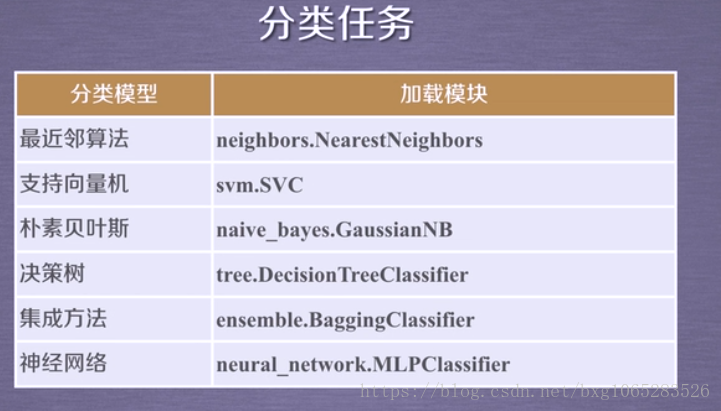
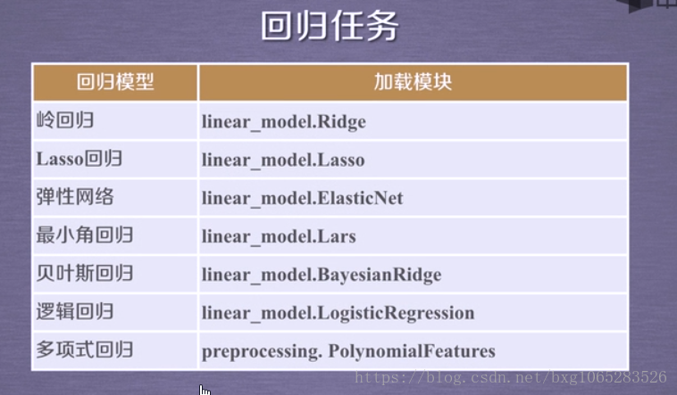
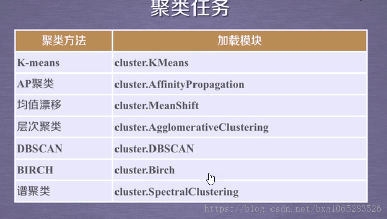
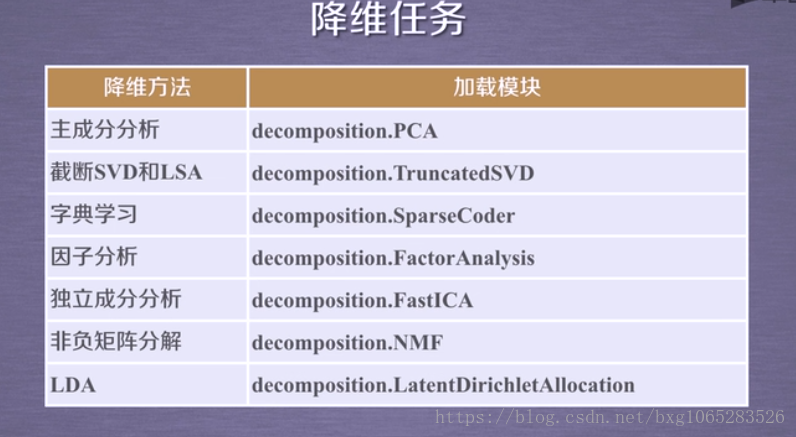

官方文档:https://scikit-learn.org/stable/

sklearn API https://scikit-learn.org/stable/modules/classes.html

中文文档:http://sklearn.apachecn.org/#/

资料:https://blog.csdn.net/bxg1065283526/article/details/80010880

https://blog.csdn.net/vapor_/article/details/80625988

sklearn是机器学习中一个常用的python第三方模块，对常用的机器学习算法进行了封装
其中包括：
1.分类（Classification）
2.回归（Regression）
3.聚类（Clustering）
4.数据降维（Dimensionality reduction）
5.常用模型（Model selection）
6.数据预处理（Preprocessing）
本文将从sklearn的安装开始讲解，由浅入深，逐步上手sklearn。0

分类任务:



回归任务:



聚类任务：



降维任务:



#### 获取数据

机器学习算法往往需要大量的数据，在skleran中获取数据通常采用两种方式，一种是使用自带的数据集，另一种是创建数据集

#### 导入数据集

sklearn自带了很多数据集，可以用来对算法进行测试分析，免去了自己再去找数据集的烦恼
其中包括：
鸢尾花数据集:load_iris()
手写数字数据集:load_digitals()
糖尿病数据集:load_diabetes()
乳腺癌数据集:load_breast_cancer()
波士顿房价数据集:load_boston()
体能训练数据集:load_linnerud()

这里以鸢尾花数据集为例导入数据集

```python
#导入sklearn的数据集
import sklearn.datasets as sk_datasets
iris = sk_datasets.load_iris()
iris_X = iris.data #导入数据
iris_y = iris.target #导入标签
```

全部数据集及datasets的操作工具


| [`datasets.clear_data_home`](https://scikit-learn.org/stable/modules/generated/sklearn.datasets.clear_data_home.html#sklearn.datasets.clear_data_home)([data_home]) | Delete all the content of the data home cache.               |
| ------------------------------------------------------------ | ------------------------------------------------------------ |
| [`datasets.dump_svmlight_file`](https://scikit-learn.org/stable/modules/generated/sklearn.datasets.dump_svmlight_file.html#sklearn.datasets.dump_svmlight_file)(X, y, f[, …]) | Dump the dataset in svmlight / libsvm file format.           |
| [`datasets.fetch_20newsgroups`](https://scikit-learn.org/stable/modules/generated/sklearn.datasets.fetch_20newsgroups.html#sklearn.datasets.fetch_20newsgroups)([data_home, …]) | Load the filenames and data from the 20 newsgroups dataset (classification). |
| [`datasets.fetch_20newsgroups_vectorized`](https://scikit-learn.org/stable/modules/generated/sklearn.datasets.fetch_20newsgroups_vectorized.html#sklearn.datasets.fetch_20newsgroups_vectorized)([…]) | Load the 20 newsgroups dataset and vectorize it into token counts (classification). |
| [`datasets.fetch_california_housing`](https://scikit-learn.org/stable/modules/generated/sklearn.datasets.fetch_california_housing.html#sklearn.datasets.fetch_california_housing)([…]) | Load the California housing dataset (regression).            |
| [`datasets.fetch_covtype`](https://scikit-learn.org/stable/modules/generated/sklearn.datasets.fetch_covtype.html#sklearn.datasets.fetch_covtype)([data_home, …]) | Load the covertype dataset (classification).                 |
| [`datasets.fetch_kddcup99`](https://scikit-learn.org/stable/modules/generated/sklearn.datasets.fetch_kddcup99.html#sklearn.datasets.fetch_kddcup99)([subset, data_home, …]) | Load the kddcup99 dataset (classification).                  |
| [`datasets.fetch_lfw_pairs`](https://scikit-learn.org/stable/modules/generated/sklearn.datasets.fetch_lfw_pairs.html#sklearn.datasets.fetch_lfw_pairs)([subset, …]) | Load the Labeled Faces in the Wild (LFW) pairs dataset (classification). |
| [`datasets.fetch_lfw_people`](https://scikit-learn.org/stable/modules/generated/sklearn.datasets.fetch_lfw_people.html#sklearn.datasets.fetch_lfw_people)([data_home, …]) | Load the Labeled Faces in the Wild (LFW) people dataset (classification). |
| [`datasets.fetch_olivetti_faces`](https://scikit-learn.org/stable/modules/generated/sklearn.datasets.fetch_olivetti_faces.html#sklearn.datasets.fetch_olivetti_faces)([data_home, …]) | Load the Olivetti faces data-set from AT&T (classification). |
| [`datasets.fetch_openml`](https://scikit-learn.org/stable/modules/generated/sklearn.datasets.fetch_openml.html#sklearn.datasets.fetch_openml)([name, version, …]) | Fetch dataset from openml by name or dataset id.             |
| [`datasets.fetch_rcv1`](https://scikit-learn.org/stable/modules/generated/sklearn.datasets.fetch_rcv1.html#sklearn.datasets.fetch_rcv1)([data_home, subset, …]) | Load the RCV1 multilabel dataset (classification).           |
| [`datasets.fetch_species_distributions`](https://scikit-learn.org/stable/modules/generated/sklearn.datasets.fetch_species_distributions.html#sklearn.datasets.fetch_species_distributions)([…]) | Loader for species distribution dataset from Phillips et.    |
| [`datasets.get_data_home`](https://scikit-learn.org/stable/modules/generated/sklearn.datasets.get_data_home.html#sklearn.datasets.get_data_home)([data_home]) | Return the path of the scikit-learn data dir.                |
| [`datasets.load_boston`](https://scikit-learn.org/stable/modules/generated/sklearn.datasets.load_boston.html#sklearn.datasets.load_boston)([return_X_y]) | Load and return the boston house-prices dataset (regression). |
| [`datasets.load_breast_cancer`](https://scikit-learn.org/stable/modules/generated/sklearn.datasets.load_breast_cancer.html#sklearn.datasets.load_breast_cancer)([return_X_y]) | Load and return the breast cancer wisconsin dataset (classification). |
| [`datasets.load_diabetes`](https://scikit-learn.org/stable/modules/generated/sklearn.datasets.load_diabetes.html#sklearn.datasets.load_diabetes)([return_X_y]) | Load and return the diabetes dataset (regression).           |
| [`datasets.load_digits`](https://scikit-learn.org/stable/modules/generated/sklearn.datasets.load_digits.html#sklearn.datasets.load_digits)([n_class, return_X_y]) | Load and return the digits dataset (classification).         |
| [`datasets.load_files`](https://scikit-learn.org/stable/modules/generated/sklearn.datasets.load_files.html#sklearn.datasets.load_files)(container_path[, …]) | Load text files with categories as subfolder names.          |
| [`datasets.load_iris`](https://scikit-learn.org/stable/modules/generated/sklearn.datasets.load_iris.html#sklearn.datasets.load_iris)([return_X_y]) | Load and return the iris dataset (classification).           |
| [`datasets.load_linnerud`](https://scikit-learn.org/stable/modules/generated/sklearn.datasets.load_linnerud.html#sklearn.datasets.load_linnerud)([return_X_y]) | Load and return the linnerud dataset (multivariate regression). |
| [`datasets.load_sample_image`](https://scikit-learn.org/stable/modules/generated/sklearn.datasets.load_sample_image.html#sklearn.datasets.load_sample_image)(image_name) | Load the numpy array of a single sample image                |
| [`datasets.load_sample_images`](https://scikit-learn.org/stable/modules/generated/sklearn.datasets.load_sample_images.html#sklearn.datasets.load_sample_images)() | Load sample images for image manipulation.                   |
| [`datasets.load_svmlight_file`](https://scikit-learn.org/stable/modules/generated/sklearn.datasets.load_svmlight_file.html#sklearn.datasets.load_svmlight_file)(f[, n_features, …]) | Load datasets in the svmlight / libsvm format into sparse CSR matrix |
| [`datasets.load_svmlight_files`](https://scikit-learn.org/stable/modules/generated/sklearn.datasets.load_svmlight_files.html#sklearn.datasets.load_svmlight_files)(files[, …]) | Load dataset from multiple files in SVMlight format          |
| [`datasets.load_wine`](https://scikit-learn.org/stable/modules/generated/sklearn.datasets.load_wine.html#sklearn.datasets.load_wine)([return_X_y]) | Load and return the wine dataset (classification).           |


#### 创建数据集

使用skleran的样本生成器(samples generator)可以创建数据，sklearn.datasets.samples_generator中包含了大量创建样本数据的方法。

这里以分类问题创建样本数据

```java
import sklearn.datasets.samples_generator as sk_sample_generator
X,y=sk_sample_generator.make_classification(n_samples=6,n_features=5,n_informative=2,n_redundant=3,n_classes=2,n_clusters_per_class=2,scale=1,random_state=20)
for x_,y_ in zip(X,y):
    print(y_,end=": ")
    print(x_)
```

参数说明：
n_features :特征个数= n_informative（） + n_redundant + n_repeated
n_informative：多信息特征的个数
n_redundant：冗余信息，informative特征的随机线性组合
n_repeated ：重复信息，随机提取n_informative和n_redundant 特征
n_classes：分类类别
n_clusters_per_class ：某一个类别是由几个cluster构成的
random_state：随机种子，使得实验可重复
n_classes*n_clusters_per_class 要小于或等于 2^n_informative

打印结果：

```
0: [ 0.64459602  0.92767918 -1.32091378 -1.25725859 -0.74386837]
0: [ 1.66098845  2.22206181 -2.86249859 -3.28323172 -1.62389676]
0: [ 0.27019475 -0.12572907  1.1003977  -0.6600737   0.58334745]
1: [-0.77182836 -1.03692724  1.34422289  1.52452016  0.76221055]
1: [-0.1407289   0.32675611 -1.41296696  0.4113583  -0.75833145]
1: [-0.76656634 -0.35589955 -0.83132182  1.68841011 -0.4153836 ]
```

可以创建各种类型的数据用于测试 


| [`datasets.make_biclusters`](https://scikit-learn.org/stable/modules/generated/sklearn.datasets.make_biclusters.html#sklearn.datasets.make_biclusters)(shape, n_clusters) | Generate an array with constant block diagonal structure for biclustering. |
| ------------------------------------------------------------ | ------------------------------------------------------------ |
| [`datasets.make_blobs`](https://scikit-learn.org/stable/modules/generated/sklearn.datasets.make_blobs.html#sklearn.datasets.make_blobs)([n_samples, n_features, …]) | Generate isotropic Gaussian blobs for clustering.            |
| [`datasets.make_checkerboard`](https://scikit-learn.org/stable/modules/generated/sklearn.datasets.make_checkerboard.html#sklearn.datasets.make_checkerboard)(shape, n_clusters) | Generate an array with block checkerboard structure for biclustering. |
| [`datasets.make_circles`](https://scikit-learn.org/stable/modules/generated/sklearn.datasets.make_circles.html#sklearn.datasets.make_circles)([n_samples, shuffle, …]) | Make a large circle containing a smaller circle in 2d.       |
| [`datasets.make_classification`](https://scikit-learn.org/stable/modules/generated/sklearn.datasets.make_classification.html#sklearn.datasets.make_classification)([n_samples, …]) | Generate a random n-class classification problem.            |
| [`datasets.make_friedman1`](https://scikit-learn.org/stable/modules/generated/sklearn.datasets.make_friedman1.html#sklearn.datasets.make_friedman1)([n_samples, …]) | Generate the “Friedman #1” regression problem                |
| [`datasets.make_friedman2`](https://scikit-learn.org/stable/modules/generated/sklearn.datasets.make_friedman2.html#sklearn.datasets.make_friedman2)([n_samples, noise, …]) | Generate the “Friedman #2” regression problem                |
| [`datasets.make_friedman3`](https://scikit-learn.org/stable/modules/generated/sklearn.datasets.make_friedman3.html#sklearn.datasets.make_friedman3)([n_samples, noise, …]) | Generate the “Friedman #3” regression problem                |
| [`datasets.make_gaussian_quantiles`](https://scikit-learn.org/stable/modules/generated/sklearn.datasets.make_gaussian_quantiles.html#sklearn.datasets.make_gaussian_quantiles)([mean, …]) | Generate isotropic Gaussian and label samples by quantile    |
| [`datasets.make_hastie_10_2`](https://scikit-learn.org/stable/modules/generated/sklearn.datasets.make_hastie_10_2.html#sklearn.datasets.make_hastie_10_2)([n_samples, …]) | Generates data for binary classification used in Hastie et al. |
| [`datasets.make_low_rank_matrix`](https://scikit-learn.org/stable/modules/generated/sklearn.datasets.make_low_rank_matrix.html#sklearn.datasets.make_low_rank_matrix)([n_samples, …]) | Generate a mostly low rank matrix with bell-shaped singular values |
| [`datasets.make_moons`](https://scikit-learn.org/stable/modules/generated/sklearn.datasets.make_moons.html#sklearn.datasets.make_moons)([n_samples, shuffle, …]) | Make two interleaving half circles                           |
| [`datasets.make_multilabel_classification`](https://scikit-learn.org/stable/modules/generated/sklearn.datasets.make_multilabel_classification.html#sklearn.datasets.make_multilabel_classification)([…]) | Generate a random multilabel classification problem.         |
| [`datasets.make_regression`](https://scikit-learn.org/stable/modules/generated/sklearn.datasets.make_regression.html#sklearn.datasets.make_regression)([n_samples, …]) | Generate a random regression problem.                        |
| [`datasets.make_s_curve`](https://scikit-learn.org/stable/modules/generated/sklearn.datasets.make_s_curve.html#sklearn.datasets.make_s_curve)([n_samples, noise, …]) | Generate an S curve dataset.                                 |
| [`datasets.make_sparse_coded_signal`](https://scikit-learn.org/stable/modules/generated/sklearn.datasets.make_sparse_coded_signal.html#sklearn.datasets.make_sparse_coded_signal)(n_samples, …) | Generate a signal as a sparse combination of dictionary elements. |
| [`datasets.make_sparse_spd_matrix`](https://scikit-learn.org/stable/modules/generated/sklearn.datasets.make_sparse_spd_matrix.html#sklearn.datasets.make_sparse_spd_matrix)([dim, …]) | Generate a sparse symmetric definite positive matrix.        |
| [`datasets.make_sparse_uncorrelated`](https://scikit-learn.org/stable/modules/generated/sklearn.datasets.make_sparse_uncorrelated.html#sklearn.datasets.make_sparse_uncorrelated)([…]) | Generate a random regression problem with sparse uncorrelated design |
| [`datasets.make_spd_matrix`](https://scikit-learn.org/stable/modules/generated/sklearn.datasets.make_spd_matrix.html#sklearn.datasets.make_spd_matrix)(n_dim[, random_state]) | Generate a random symmetric, positive-definite matrix.       |
| [`datasets.make_swiss_roll`](https://scikit-learn.org/stable/modules/generated/sklearn.datasets.make_swiss_roll.html#sklearn.datasets.make_swiss_roll)([n_samples, noise, …]) | Generate a swiss roll dataset.                               |

#### 数据集的划分

机器学习的过程正往往需要对数据集进行划分，常分为训练集，测试集。sklearn中的model_selection模块为我们提供了划分数据集的方法。包括分割训练数据和测试数据,K折交叉,交叉验证

具体见: See the [Cross-validation: evaluating estimator performance](https://scikit-learn.org/stable/modules/cross_validation.html#cross-validation), [Tuning the hyper-parameters of an estimator](https://scikit-learn.org/stable/modules/grid_search.html#grid-search) and[Learning curve](https://scikit-learn.org/stable/modules/learning_curve.html#learning-curve) sections for further details.

以鸢尾花数据集为例进行划分

```python
import sklearn.model_selection as sk_model_selection
X_train,X_test,y_train,y_test = sk_model_selection.train_test_split(iris_X,iris_y,train_size=0.3,random_state=20)
```

参数说明：
arrays：样本数组，包含特征向量和标签
test_size：
　　float-获得多大比重的测试样本 （默认：0.25）
　　int - 获得多少个测试样本
train_size: 同test_size
random_state:int - 随机种子（种子固定，实验可复现）
shuffle - 是否在分割之前对数据进行洗牌（默认True）

后面我们训练模型使用的数据集都基于此

##### Splitter Classes

| [`model_selection.GroupKFold`](https://scikit-learn.org/stable/modules/generated/sklearn.model_selection.GroupKFold.html#sklearn.model_selection.GroupKFold)([n_splits]) | K-fold iterator variant with non-overlapping groups. |
| ------------------------------------------------------------ | ---------------------------------------------------- |
| [`model_selection.GroupShuffleSplit`](https://scikit-learn.org/stable/modules/generated/sklearn.model_selection.GroupShuffleSplit.html#sklearn.model_selection.GroupShuffleSplit)([…]) | Shuffle-Group(s)-Out cross-validation iterator       |
| [`model_selection.KFold`](https://scikit-learn.org/stable/modules/generated/sklearn.model_selection.KFold.html#sklearn.model_selection.KFold)([n_splits, shuffle, …]) | K-Folds cross-validator                              |
| [`model_selection.LeaveOneGroupOut`](https://scikit-learn.org/stable/modules/generated/sklearn.model_selection.LeaveOneGroupOut.html#sklearn.model_selection.LeaveOneGroupOut) | Leave One Group Out cross-validator                  |
| [`model_selection.LeavePGroupsOut`](https://scikit-learn.org/stable/modules/generated/sklearn.model_selection.LeavePGroupsOut.html#sklearn.model_selection.LeavePGroupsOut)(n_groups) | Leave P Group(s) Out cross-validator                 |
| [`model_selection.LeaveOneOut`](https://scikit-learn.org/stable/modules/generated/sklearn.model_selection.LeaveOneOut.html#sklearn.model_selection.LeaveOneOut) | Leave-One-Out cross-validator                        |
| [`model_selection.LeavePOut`](https://scikit-learn.org/stable/modules/generated/sklearn.model_selection.LeavePOut.html#sklearn.model_selection.LeavePOut)(p) | Leave-P-Out cross-validator                          |
| [`model_selection.PredefinedSplit`](https://scikit-learn.org/stable/modules/generated/sklearn.model_selection.PredefinedSplit.html#sklearn.model_selection.PredefinedSplit)(test_fold) | Predefined split cross-validator                     |
| [`model_selection.RepeatedKFold`](https://scikit-learn.org/stable/modules/generated/sklearn.model_selection.RepeatedKFold.html#sklearn.model_selection.RepeatedKFold)([n_splits, …]) | Repeated K-Fold cross validator.                     |
| [`model_selection.RepeatedStratifiedKFold`](https://scikit-learn.org/stable/modules/generated/sklearn.model_selection.RepeatedStratifiedKFold.html#sklearn.model_selection.RepeatedStratifiedKFold)([…]) | Repeated Stratified K-Fold cross validator.          |
| [`model_selection.ShuffleSplit`](https://scikit-learn.org/stable/modules/generated/sklearn.model_selection.ShuffleSplit.html#sklearn.model_selection.ShuffleSplit)([n_splits, …]) | Random permutation cross-validator                   |
| [`model_selection.StratifiedKFold`](https://scikit-learn.org/stable/modules/generated/sklearn.model_selection.StratifiedKFold.html#sklearn.model_selection.StratifiedKFold)([n_splits, …]) | Stratified K-Folds cross-validator                   |
| [`model_selection.StratifiedShuffleSplit`](https://scikit-learn.org/stable/modules/generated/sklearn.model_selection.StratifiedShuffleSplit.html#sklearn.model_selection.StratifiedShuffleSplit)([…]) | Stratified ShuffleSplit cross-validator              |
| [`model_selection.TimeSeriesSplit`](https://scikit-learn.org/stable/modules/generated/sklearn.model_selection.TimeSeriesSplit.html#sklearn.model_selection.TimeSeriesSplit)([n_splits, …]) | Time Series cross-validator                          |

##### Splitter Functions

| [`model_selection.check_cv`](https://scikit-learn.org/stable/modules/generated/sklearn.model_selection.check_cv.html#sklearn.model_selection.check_cv)([cv, y, classifier]) | Input checker utility for building a cross-validator        |
| ------------------------------------------------------------ | ----------------------------------------------------------- |
| [`model_selection.train_test_split`](https://scikit-learn.org/stable/modules/generated/sklearn.model_selection.train_test_split.html#sklearn.model_selection.train_test_split)(\*arrays, …) | Split arrays or matrices into random train and test subsets |

##### Hyper-parameter optimizers

| [`model_selection.GridSearchCV`](https://scikit-learn.org/stable/modules/generated/sklearn.model_selection.GridSearchCV.html#sklearn.model_selection.GridSearchCV)(estimator, …) | Exhaustive search over specified parameter values for an estimator.(常用于调参) |
| ------------------------------------------------------------ | ------------------------------------------------------------ |
| [`model_selection.ParameterGrid`](https://scikit-learn.org/stable/modules/generated/sklearn.model_selection.ParameterGrid.html#sklearn.model_selection.ParameterGrid)(param_grid) | Grid of parameters with a discrete number of values for each. |
| [`model_selection.ParameterSampler`](https://scikit-learn.org/stable/modules/generated/sklearn.model_selection.ParameterSampler.html#sklearn.model_selection.ParameterSampler)(…[, …]) | Generator on parameters sampled from given distributions.    |
| [`model_selection.RandomizedSearchCV`](https://scikit-learn.org/stable/modules/generated/sklearn.model_selection.RandomizedSearchCV.html#sklearn.model_selection.RandomizedSearchCV)(…[, …]) | Randomized search on hyper parameters.                       |

| [`model_selection.fit_grid_point`](https://scikit-learn.org/stable/modules/generated/sklearn.model_selection.fit_grid_point.html#sklearn.model_selection.fit_grid_point)(X, y, …[, …]) | Run fit on one set of parameters. |
| ------------------------------------------------------------ | --------------------------------- |
|                                                              |                                   |

##### Model validation

| [`model_selection.cross_validate`](https://scikit-learn.org/stable/modules/generated/sklearn.model_selection.cross_validate.html#sklearn.model_selection.cross_validate)(estimator, X) | Evaluate metric(s) by cross-validation and also record fit/score times. |
| ------------------------------------------------------------ | ------------------------------------------------------------ |
| [`model_selection.cross_val_predict`](https://scikit-learn.org/stable/modules/generated/sklearn.model_selection.cross_val_predict.html#sklearn.model_selection.cross_val_predict)(estimator, X) | Generate cross-validated estimates for each input data point |
| [`model_selection.cross_val_score`](https://scikit-learn.org/stable/modules/generated/sklearn.model_selection.cross_val_score.html#sklearn.model_selection.cross_val_score)(estimator, X) | Evaluate a score by cross-validation                         |
| [`model_selection.learning_curve`](https://scikit-learn.org/stable/modules/generated/sklearn.model_selection.learning_curve.html#sklearn.model_selection.learning_curve)(estimator, X, y) | Learning curve.                                              |
| [`model_selection.permutation_test_score`](https://scikit-learn.org/stable/modules/generated/sklearn.model_selection.permutation_test_score.html#sklearn.model_selection.permutation_test_score)(…) | Evaluate the significance of a cross-validated score with permutations |
| [`model_selection.validation_curve`](https://scikit-learn.org/stable/modules/generated/sklearn.model_selection.validation_curve.html#sklearn.model_selection.validation_curve)(estimator, …) | Validation curve.                                            |

#### 数据预处理

我们为什么要进行数据预处理？
通常，真实生活中，我们获得的数据中往往存在很多的无用信息，甚至存在错误信息，而机器学习中有一句话叫做”Garbage in，Garbage out”，数据的健康程度对于算法结果的影响极大。数据预处理就是让那些冗余混乱的源数据变得能满足其应用要求。
当然，仅仅是数据预处理的方法就可以写好几千字的文章了，在这里只谈及几个基础的数据预处理的方法。
skleran中为我们提供了一个数据预处理的package：preprocessing，我们直接导入即可

```python
import sklearn.preprocessing as sk_preprocessing
```

下面的例子我们使用:[[1, -1, 2], [0, 2, -1], [0, 1, -2]]做为初始数据。

##### 数据的归一化

基于mean和std的标准化

```python
scaler = sk_preprocessing.StandardScaler().fit(X)
new_X = scaler.transform(X)
print('基于mean和std的标准化:',new_X)
```

打印结果:

```
基于mean和std的标准化:
 [[ 1.41421356 -1.33630621  1.37281295]
 [-0.70710678  1.06904497 -0.39223227]
 [-0.70710678  0.26726124 -0.98058068]]
```

规范化到一定区间内 feature_range为数据规范化的范围

```python
scaler = sk_preprocessing.MinMaxScaler(feature_range=(0,1)).fit(X)
new_X=scaler.transform(X)
print('规范化到一定区间内',new_X)
```

打印结果:

```
规范化到一定区间内
 [[1.          0.          1.        ]
 [ 0.          1.          0.25      ]
 [ 0.          0.66666667  0.        ]]
```

##### 数据的正则化

首先求出样本的p-范数，然后该样本的所有元素都要除以该范数，这样最终使得每个样本的范数都为1

```python
new_X = sk_preprocessing.normalize(X,norm='l2')
print('求二范数',new_X)
```

打印结果：

```
规范化到一定区间内
 [[0.40824829 -0.40824829  0.81649658]
 [ 0.          0.89442719 -0.4472136 ]
 [ 0.          0.4472136  -0.89442719]]
```

The [`sklearn.preprocessing`](https://scikit-learn.org/stable/modules/classes.html#module-sklearn.preprocessing) module includes scaling, centering, normalization, binarization and imputation methods.

**User guide:** See the [Preprocessing data](https://scikit-learn.org/stable/modules/preprocessing.html#preprocessing) section for further details.

| [`preprocessing.Binarizer`](https://scikit-learn.org/stable/modules/generated/sklearn.preprocessing.Binarizer.html#sklearn.preprocessing.Binarizer)([threshold, copy]) | Binarize data (set feature values to 0 or 1) according to a threshold(二值化) |
| ------------------------------------------------------------ | ------------------------------------------------------------ |
| [`preprocessing.FunctionTransformer`](https://scikit-learn.org/stable/modules/generated/sklearn.preprocessing.FunctionTransformer.html#sklearn.preprocessing.FunctionTransformer)([func, …]) | Constructs a transformer from an arbitrary callable.         |
| [`preprocessing.KBinsDiscretizer`](https://scikit-learn.org/stable/modules/generated/sklearn.preprocessing.KBinsDiscretizer.html#sklearn.preprocessing.KBinsDiscretizer)([n_bins, …]) | Bin continuous data into intervals.                          |
| [`preprocessing.KernelCenterer`](https://scikit-learn.org/stable/modules/generated/sklearn.preprocessing.KernelCenterer.html#sklearn.preprocessing.KernelCenterer)() | Center a kernel matrix                                       |
| [`preprocessing.LabelBinarizer`](https://scikit-learn.org/stable/modules/generated/sklearn.preprocessing.LabelBinarizer.html#sklearn.preprocessing.LabelBinarizer)([neg_label, …]) | Binarize labels in a one-vs-all fashion                      |
| [`preprocessing.LabelEncoder`](https://scikit-learn.org/stable/modules/generated/sklearn.preprocessing.LabelEncoder.html#sklearn.preprocessing.LabelEncoder) | Encode labels with value between 0 and n_classes-1.(标签化)  |
| [`preprocessing.MultiLabelBinarizer`](https://scikit-learn.org/stable/modules/generated/sklearn.preprocessing.MultiLabelBinarizer.html#sklearn.preprocessing.MultiLabelBinarizer)([classes, …]) | Transform between iterable of iterables and a multilabel format |
| [`preprocessing.MaxAbsScaler`](https://scikit-learn.org/stable/modules/generated/sklearn.preprocessing.MaxAbsScaler.html#sklearn.preprocessing.MaxAbsScaler)([copy]) | Scale each feature by its maximum absolute value.            |
| [`preprocessing.MinMaxScaler`](https://scikit-learn.org/stable/modules/generated/sklearn.preprocessing.MinMaxScaler.html#sklearn.preprocessing.MinMaxScaler)([feature_range, copy]) | Transforms features by scaling each feature to a given range. |
| [`preprocessing.Normalizer`](https://scikit-learn.org/stable/modules/generated/sklearn.preprocessing.Normalizer.html#sklearn.preprocessing.Normalizer)([norm, copy]) | Normalize samples individually to unit norm.                 |
| [`preprocessing.OneHotEncoder`](https://scikit-learn.org/stable/modules/generated/sklearn.preprocessing.OneHotEncoder.html#sklearn.preprocessing.OneHotEncoder)([n_values, …]) | Encode categorical integer features as a one-hot numeric array.(one-hot编码) |
| [`preprocessing.OrdinalEncoder`](https://scikit-learn.org/stable/modules/generated/sklearn.preprocessing.OrdinalEncoder.html#sklearn.preprocessing.OrdinalEncoder)([categories, dtype]) | Encode categorical features as an integer array.             |
| [`preprocessing.PolynomialFeatures`](https://scikit-learn.org/stable/modules/generated/sklearn.preprocessing.PolynomialFeatures.html#sklearn.preprocessing.PolynomialFeatures)([degree, …]) | Generate polynomial and interaction features.                |
| [`preprocessing.PowerTransformer`](https://scikit-learn.org/stable/modules/generated/sklearn.preprocessing.PowerTransformer.html#sklearn.preprocessing.PowerTransformer)([method, …]) | Apply a power transform featurewise to make data more Gaussian-like. |
| [`preprocessing.QuantileTransformer`](https://scikit-learn.org/stable/modules/generated/sklearn.preprocessing.QuantileTransformer.html#sklearn.preprocessing.QuantileTransformer)([…]) | Transform features using quantiles information.              |
| [`preprocessing.RobustScaler`](https://scikit-learn.org/stable/modules/generated/sklearn.preprocessing.RobustScaler.html#sklearn.preprocessing.RobustScaler)([with_centering, …]) | Scale features using statistics that are robust to outliers. |
| [`preprocessing.StandardScaler`](https://scikit-learn.org/stable/modules/generated/sklearn.preprocessing.StandardScaler.html#sklearn.preprocessing.StandardScaler)([copy, …]) | Standardize features by removing the mean and scaling to unit variance |

| [`preprocessing.add_dummy_feature`](https://scikit-learn.org/stable/modules/generated/sklearn.preprocessing.add_dummy_feature.html#sklearn.preprocessing.add_dummy_feature)(X[, value]) | Augment dataset with an additional dummy feature.            |
| ------------------------------------------------------------ | ------------------------------------------------------------ |
| [`preprocessing.binarize`](https://scikit-learn.org/stable/modules/generated/sklearn.preprocessing.binarize.html#sklearn.preprocessing.binarize)(X[, threshold, copy]) | Boolean thresholding of array-like or scipy.sparse matrix    |
| [`preprocessing.label_binarize`](https://scikit-learn.org/stable/modules/generated/sklearn.preprocessing.label_binarize.html#sklearn.preprocessing.label_binarize)(y, classes[, …]) | Binarize labels in a one-vs-all fashion                      |
| [`preprocessing.maxabs_scale`](https://scikit-learn.org/stable/modules/generated/sklearn.preprocessing.maxabs_scale.html#sklearn.preprocessing.maxabs_scale)(X[, axis, copy]) | Scale each feature to the [-1, 1] range without breaking the sparsity. |
| [`preprocessing.minmax_scale`](https://scikit-learn.org/stable/modules/generated/sklearn.preprocessing.minmax_scale.html#sklearn.preprocessing.minmax_scale)(X[, …]) | Transforms features by scaling each feature to a given range. |
| [`preprocessing.normalize`](https://scikit-learn.org/stable/modules/generated/sklearn.preprocessing.normalize.html#sklearn.preprocessing.normalize)(X[, norm, axis, …]) | Scale input vectors individually to unit norm (vector length). |
| [`preprocessing.quantile_transform`](https://scikit-learn.org/stable/modules/generated/sklearn.preprocessing.quantile_transform.html#sklearn.preprocessing.quantile_transform)(X[, axis, …]) | Transform features using quantiles information.              |
| [`preprocessing.robust_scale`](https://scikit-learn.org/stable/modules/generated/sklearn.preprocessing.robust_scale.html#sklearn.preprocessing.robust_scale)(X[, axis, …]) | Standardize a dataset along any axis                         |
| [`preprocessing.scale`](https://scikit-learn.org/stable/modules/generated/sklearn.preprocessing.scale.html#sklearn.preprocessing.scale)(X[, axis, with_mean, …]) | Standardize a dataset along any axis                         |
| [`preprocessing.power_transform`](https://scikit-learn.org/stable/modules/generated/sklearn.preprocessing.power_transform.html#sklearn.preprocessing.power_transform)(X[, method, …]) | Power transforms are a family of parametric, monotonic transformations that are applied to make data more Gaussian-like. |


#### 特征选择

The [`sklearn.feature_selection`](https://scikit-learn.org/stable/modules/classes.html#module-sklearn.feature_selection) module implements feature selection algorithms. It currently includes univariate filter selection methods and the recursive feature elimination algorithm.

**User guide:** See the [Feature selection](https://scikit-learn.org/stable/modules/feature_selection.html#feature-selection) section for further details.

| [`feature_selection.GenericUnivariateSelect`](https://scikit-learn.org/stable/modules/generated/sklearn.feature_selection.GenericUnivariateSelect.html#sklearn.feature_selection.GenericUnivariateSelect)([…]) | Univariate feature selector with configurable strategy.      |
| ------------------------------------------------------------ | ------------------------------------------------------------ |
| [`feature_selection.SelectPercentile`](https://scikit-learn.org/stable/modules/generated/sklearn.feature_selection.SelectPercentile.html#sklearn.feature_selection.SelectPercentile)([…]) | Select features according to a percentile of the highest scores. |
| [`feature_selection.SelectKBest`](https://scikit-learn.org/stable/modules/generated/sklearn.feature_selection.SelectKBest.html#sklearn.feature_selection.SelectKBest)([score_func, k]) | Select features according to the k highest scores.           |
| [`feature_selection.SelectFpr`](https://scikit-learn.org/stable/modules/generated/sklearn.feature_selection.SelectFpr.html#sklearn.feature_selection.SelectFpr)([score_func, alpha]) | Filter: Select the pvalues below alpha based on a FPR test.  |
| [`feature_selection.SelectFdr`](https://scikit-learn.org/stable/modules/generated/sklearn.feature_selection.SelectFdr.html#sklearn.feature_selection.SelectFdr)([score_func, alpha]) | Filter: Select the p-values for an estimated false discovery rate |
| [`feature_selection.SelectFromModel`](https://scikit-learn.org/stable/modules/generated/sklearn.feature_selection.SelectFromModel.html#sklearn.feature_selection.SelectFromModel)(estimator) | Meta-transformer for selecting features based on importance weights. |
| [`feature_selection.SelectFwe`](https://scikit-learn.org/stable/modules/generated/sklearn.feature_selection.SelectFwe.html#sklearn.feature_selection.SelectFwe)([score_func, alpha]) | Filter: Select the p-values corresponding to Family-wise error rate |
| [`feature_selection.RFE`](https://scikit-learn.org/stable/modules/generated/sklearn.feature_selection.RFE.html#sklearn.feature_selection.RFE)(estimator[, …]) | Feature ranking with recursive feature elimination.          |
| [`feature_selection.RFECV`](https://scikit-learn.org/stable/modules/generated/sklearn.feature_selection.RFECV.html#sklearn.feature_selection.RFECV)(estimator[, step, …]) | Feature ranking with recursive feature elimination and cross-validated selection of the best number of features. |
| [`feature_selection.VarianceThreshold`](https://scikit-learn.org/stable/modules/generated/sklearn.feature_selection.VarianceThreshold.html#sklearn.feature_selection.VarianceThreshold)([threshold]) | Feature selector that removes all low-variance features.     |

| [`feature_selection.chi2`](https://scikit-learn.org/stable/modules/generated/sklearn.feature_selection.chi2.html#sklearn.feature_selection.chi2)(X, y) | Compute chi-squared stats between each non-negative feature and class. |
| ------------------------------------------------------------ | ------------------------------------------------------------ |
| [`feature_selection.f_classif`](https://scikit-learn.org/stable/modules/generated/sklearn.feature_selection.f_classif.html#sklearn.feature_selection.f_classif)(X, y) | Compute the ANOVA F-value for the provided sample.           |
| [`feature_selection.f_regression`](https://scikit-learn.org/stable/modules/generated/sklearn.feature_selection.f_regression.html#sklearn.feature_selection.f_regression)(X, y[, center]) | Univariate linear regression tests.                          |
| [`feature_selection.mutual_info_classif`](https://scikit-learn.org/stable/modules/generated/sklearn.feature_selection.mutual_info_classif.html#sklearn.feature_selection.mutual_info_classif)(X, y) | Estimate mutual information for a discrete target variable.  |
| [`feature_selection.mutual_info_regression`](https://scikit-learn.org/stable/modules/generated/sklearn.feature_selection.mutual_info_regression.html#sklearn.feature_selection.mutual_info_regression)(X, y) | Estimate mutual information for a continuous target variable. |

#### 特征提取

The [`sklearn.feature_extraction`](https://scikit-learn.org/stable/modules/classes.html#module-sklearn.feature_extraction) module deals with feature extraction from raw data. It currently includes methods to extract features from text and images.

**User guide:** See the [Feature extraction](https://scikit-learn.org/stable/modules/feature_extraction.html#feature-extraction) section for further details.

| [`feature_extraction.DictVectorizer`](https://scikit-learn.org/stable/modules/generated/sklearn.feature_extraction.DictVectorizer.html#sklearn.feature_extraction.DictVectorizer)([dtype, …]) | Transforms lists of feature-value mappings to vectors. |
| ------------------------------------------------------------ | ------------------------------------------------------ |
| [`feature_extraction.FeatureHasher`](https://scikit-learn.org/stable/modules/generated/sklearn.feature_extraction.FeatureHasher.html#sklearn.feature_extraction.FeatureHasher)([…]) | Implements feature hashing, aka the hashing trick.     |


##### From images

The [`sklearn.feature_extraction.image`](https://scikit-learn.org/stable/modules/classes.html#module-sklearn.feature_extraction.image) submodule gathers utilities to extract features from images.

| [`feature_extraction.image.extract_patches_2d`](https://scikit-learn.org/stable/modules/generated/sklearn.feature_extraction.image.extract_patches_2d.html#sklearn.feature_extraction.image.extract_patches_2d)(…) | Reshape a 2D image into a collection of patches  |
| ------------------------------------------------------------ | ------------------------------------------------ |
| [`feature_extraction.image.grid_to_graph`](https://scikit-learn.org/stable/modules/generated/sklearn.feature_extraction.image.grid_to_graph.html#sklearn.feature_extraction.image.grid_to_graph)(n_x, n_y) | Graph of the pixel-to-pixel connections          |
| [`feature_extraction.image.img_to_graph`](https://scikit-learn.org/stable/modules/generated/sklearn.feature_extraction.image.img_to_graph.html#sklearn.feature_extraction.image.img_to_graph)(img[, …]) | Graph of the pixel-to-pixel gradient connections |
| [`feature_extraction.image.reconstruct_from_patches_2d`](https://scikit-learn.org/stable/modules/generated/sklearn.feature_extraction.image.reconstruct_from_patches_2d.html#sklearn.feature_extraction.image.reconstruct_from_patches_2d)(…) | Reconstruct the image from all of its patches.   |
| [`feature_extraction.image.PatchExtractor`](https://scikit-learn.org/stable/modules/generated/sklearn.feature_extraction.image.PatchExtractor.html#sklearn.feature_extraction.image.PatchExtractor)([…]) | Extracts patches from a collection of images     |

##### From text

The [`sklearn.feature_extraction.text`](https://scikit-learn.org/stable/modules/classes.html#module-sklearn.feature_extraction.text) submodule gathers utilities to build feature vectors from text documents.

| [`feature_extraction.text.CountVectorizer`](https://scikit-learn.org/stable/modules/generated/sklearn.feature_extraction.text.CountVectorizer.html#sklearn.feature_extraction.text.CountVectorizer)([…]) | Convert a collection of text documents to a matrix of token counts |
| ------------------------------------------------------------ | ------------------------------------------------------------ |
| [`feature_extraction.text.HashingVectorizer`](https://scikit-learn.org/stable/modules/generated/sklearn.feature_extraction.text.HashingVectorizer.html#sklearn.feature_extraction.text.HashingVectorizer)([…]) | Convert a collection of text documents to a matrix of token occurrences |
| [`feature_extraction.text.TfidfTransformer`](https://scikit-learn.org/stable/modules/generated/sklearn.feature_extraction.text.TfidfTransformer.html#sklearn.feature_extraction.text.TfidfTransformer)([…]) | Transform a count matrix to a normalized tf or tf-idf representation |
| [`feature_extraction.text.TfidfVectorizer`](https://scikit-learn.org/stable/modules/generated/sklearn.feature_extraction.text.TfidfVectorizer.html#sklearn.feature_extraction.text.TfidfVectorizer)([…]) | Convert a collection of raw documents to a matrix of TF-IDF features. |


#### 模型评估

一个训练好的模型如何去评估其性能是一件很重要的事,sklearn 中就提供了 Metrics 模块可以用于评估模型预测性能:

See the [Model evaluation: quantifying the quality of predictions](https://scikit-learn.org/stable/modules/model_evaluation.html#model-evaluation) section and the [Pairwise metrics, Affinities and Kernels](https://scikit-learn.org/stable/modules/metrics.html#metrics)section of the user guide for further details.


The [`sklearn.metrics`](https://scikit-learn.org/stable/modules/classes.html#module-sklearn.metrics) module includes score functions, performance metrics and pairwise metrics and distance computations.

##### Model Selection Interface

See the [The scoring parameter: defining model evaluation rules](https://scikit-learn.org/stable/modules/model_evaluation.html#scoring-parameter) section of the user guide for further details.

| [`metrics.check_scoring`](https://scikit-learn.org/stable/modules/generated/sklearn.metrics.check_scoring.html#sklearn.metrics.check_scoring)(estimator[, scoring, …]) | Determine scorer from user options.                       |
| ------------------------------------------------------------ | --------------------------------------------------------- |
| [`metrics.get_scorer`](https://scikit-learn.org/stable/modules/generated/sklearn.metrics.get_scorer.html#sklearn.metrics.get_scorer)(scoring) | Get a scorer from string                                  |
| [`metrics.make_scorer`](https://scikit-learn.org/stable/modules/generated/sklearn.metrics.make_scorer.html#sklearn.metrics.make_scorer)(score_func[, …]) | Make a scorer from a performance metric or loss function. |

##### Classification metrics(分类器评估)

See the [Classification metrics](https://scikit-learn.org/stable/modules/model_evaluation.html#classification-metrics) section of the user guide for further details.

| [`metrics.accuracy_score`](https://scikit-learn.org/stable/modules/generated/sklearn.metrics.accuracy_score.html#sklearn.metrics.accuracy_score)(y_true, y_pred[, …]) | Accuracy classification score.                               |
| ------------------------------------------------------------ | ------------------------------------------------------------ |
| [`metrics.auc`](https://scikit-learn.org/stable/modules/generated/sklearn.metrics.auc.html#sklearn.metrics.auc)(x, y[, reorder]) | Compute Area Under the Curve (AUC) using the trapezoidal rule |
| [`metrics.average_precision_score`](https://scikit-learn.org/stable/modules/generated/sklearn.metrics.average_precision_score.html#sklearn.metrics.average_precision_score)(y_true, y_score) | Compute average precision (AP) from prediction scores        |
| [`metrics.balanced_accuracy_score`](https://scikit-learn.org/stable/modules/generated/sklearn.metrics.balanced_accuracy_score.html#sklearn.metrics.balanced_accuracy_score)(y_true, y_pred) | Compute the balanced accuracy                                |
| [`metrics.brier_score_loss`](https://scikit-learn.org/stable/modules/generated/sklearn.metrics.brier_score_loss.html#sklearn.metrics.brier_score_loss)(y_true, y_prob[, …]) | Compute the Brier score.                                     |
| [`metrics.classification_report`](https://scikit-learn.org/stable/modules/generated/sklearn.metrics.classification_report.html#sklearn.metrics.classification_report)(y_true, y_pred) | Build a text report showing the main classification metrics  |
| [`metrics.cohen_kappa_score`](https://scikit-learn.org/stable/modules/generated/sklearn.metrics.cohen_kappa_score.html#sklearn.metrics.cohen_kappa_score)(y1, y2[, labels, …]) | Cohen’s kappa: a statistic that measures inter-annotator agreement. |
| [`metrics.confusion_matrix`](https://scikit-learn.org/stable/modules/generated/sklearn.metrics.confusion_matrix.html#sklearn.metrics.confusion_matrix)(y_true, y_pred[, …]) | Compute confusion matrix to evaluate the accuracy of a classification |
| [`metrics.f1_score`](https://scikit-learn.org/stable/modules/generated/sklearn.metrics.f1_score.html#sklearn.metrics.f1_score)(y_true, y_pred[, labels, …]) | Compute the F1 score, also known as balanced F-score or F-measure |
| [`metrics.fbeta_score`](https://scikit-learn.org/stable/modules/generated/sklearn.metrics.fbeta_score.html#sklearn.metrics.fbeta_score)(y_true, y_pred, beta[, …]) | Compute the F-beta score                                     |
| [`metrics.hamming_loss`](https://scikit-learn.org/stable/modules/generated/sklearn.metrics.hamming_loss.html#sklearn.metrics.hamming_loss)(y_true, y_pred[, …]) | Compute the average Hamming loss.                            |
| [`metrics.hinge_loss`](https://scikit-learn.org/stable/modules/generated/sklearn.metrics.hinge_loss.html#sklearn.metrics.hinge_loss)(y_true, pred_decision[, …]) | Average hinge loss (non-regularized)                         |
| [`metrics.jaccard_score`](https://scikit-learn.org/stable/modules/generated/sklearn.metrics.jaccard_score.html#sklearn.metrics.jaccard_score)(y_true, y_pred[, …]) | Jaccard similarity coefficient score                         |
| [`metrics.log_loss`](https://scikit-learn.org/stable/modules/generated/sklearn.metrics.log_loss.html#sklearn.metrics.log_loss)(y_true, y_pred[, eps, …]) | Log loss, aka logistic loss or cross-entropy loss.           |
| [`metrics.matthews_corrcoef`](https://scikit-learn.org/stable/modules/generated/sklearn.metrics.matthews_corrcoef.html#sklearn.metrics.matthews_corrcoef)(y_true, y_pred[, …]) | Compute the Matthews correlation coefficient (MCC)           |
| [`metrics.multilabel_confusion_matrix`](https://scikit-learn.org/stable/modules/generated/sklearn.metrics.multilabel_confusion_matrix.html#sklearn.metrics.multilabel_confusion_matrix)(y_true, …) | Compute a confusion matrix for each class or sample          |
| [`metrics.precision_recall_curve`](https://scikit-learn.org/stable/modules/generated/sklearn.metrics.precision_recall_curve.html#sklearn.metrics.precision_recall_curve)(y_true, …) | Compute precision-recall pairs for different probability thresholds |
| [`metrics.precision_recall_fscore_support`](https://scikit-learn.org/stable/modules/generated/sklearn.metrics.precision_recall_fscore_support.html#sklearn.metrics.precision_recall_fscore_support)(…) | Compute precision, recall, F-measure and support for each class |
| [`metrics.precision_score`](https://scikit-learn.org/stable/modules/generated/sklearn.metrics.precision_score.html#sklearn.metrics.precision_score)(y_true, y_pred[, …]) | Compute the precision                                        |
| [`metrics.recall_score`](https://scikit-learn.org/stable/modules/generated/sklearn.metrics.recall_score.html#sklearn.metrics.recall_score)(y_true, y_pred[, …]) | Compute the recall                                           |
| [`metrics.roc_auc_score`](https://scikit-learn.org/stable/modules/generated/sklearn.metrics.roc_auc_score.html#sklearn.metrics.roc_auc_score)(y_true, y_score[, …]) | Compute Area Under the Receiver Operating Characteristic Curve (ROC AUC) from prediction scores. |
| [`metrics.roc_curve`](https://scikit-learn.org/stable/modules/generated/sklearn.metrics.roc_curve.html#sklearn.metrics.roc_curve)(y_true, y_score[, …]) | Compute Receiver operating characteristic (ROC)              |
| [`metrics.zero_one_loss`](https://scikit-learn.org/stable/modules/generated/sklearn.metrics.zero_one_loss.html#sklearn.metrics.zero_one_loss)(y_true, y_pred[, …]) | Zero-one classification loss.                                |

##### Regression metrics(回归评估)

See the [Regression metrics](https://scikit-learn.org/stable/modules/model_evaluation.html#regression-metrics) section of the user guide for further details.

| [`metrics.explained_variance_score`](https://scikit-learn.org/stable/modules/generated/sklearn.metrics.explained_variance_score.html#sklearn.metrics.explained_variance_score)(y_true, y_pred) | Explained variance regression score function                 |
| ------------------------------------------------------------ | ------------------------------------------------------------ |
| [`metrics.max_error`](https://scikit-learn.org/stable/modules/generated/sklearn.metrics.max_error.html#sklearn.metrics.max_error)(y_true, y_pred) | max_error metric calculates the maximum residual error.      |
| [`metrics.mean_absolute_error`](https://scikit-learn.org/stable/modules/generated/sklearn.metrics.mean_absolute_error.html#sklearn.metrics.mean_absolute_error)(y_true, y_pred) | Mean absolute error regression loss                          |
| [`metrics.mean_squared_error`](https://scikit-learn.org/stable/modules/generated/sklearn.metrics.mean_squared_error.html#sklearn.metrics.mean_squared_error)(y_true, y_pred[, …]) | Mean squared error regression loss                           |
| [`metrics.mean_squared_log_error`](https://scikit-learn.org/stable/modules/generated/sklearn.metrics.mean_squared_log_error.html#sklearn.metrics.mean_squared_log_error)(y_true, y_pred) | Mean squared logarithmic error regression loss               |
| [`metrics.median_absolute_error`](https://scikit-learn.org/stable/modules/generated/sklearn.metrics.median_absolute_error.html#sklearn.metrics.median_absolute_error)(y_true, y_pred) | Median absolute error regression loss                        |
| [`metrics.r2_score`](https://scikit-learn.org/stable/modules/generated/sklearn.metrics.r2_score.html#sklearn.metrics.r2_score)(y_true, y_pred[, …]) | R^2 (coefficient of determination) regression score function. |

##### Multilabel ranking metrics

See the [Multilabel ranking metrics](https://scikit-learn.org/stable/modules/model_evaluation.html#multilabel-ranking-metrics) section of the user guide for further details.

| [`metrics.coverage_error`](https://scikit-learn.org/stable/modules/generated/sklearn.metrics.coverage_error.html#sklearn.metrics.coverage_error)(y_true, y_score[, …]) | Coverage error measure                  |
| ------------------------------------------------------------ | --------------------------------------- |
| [`metrics.label_ranking_average_precision_score`](https://scikit-learn.org/stable/modules/generated/sklearn.metrics.label_ranking_average_precision_score.html#sklearn.metrics.label_ranking_average_precision_score)(…) | Compute ranking-based average precision |
| [`metrics.label_ranking_loss`](https://scikit-learn.org/stable/modules/generated/sklearn.metrics.label_ranking_loss.html#sklearn.metrics.label_ranking_loss)(y_true, y_score) | Compute Ranking loss measure            |

##### Clustering metrics(聚类评估)

See the [Clustering performance evaluation](https://scikit-learn.org/stable/modules/clustering.html#clustering-evaluation) section of the user guide for further details.


The [`sklearn.metrics.cluster`](https://scikit-learn.org/stable/modules/classes.html#module-sklearn.metrics.cluster) submodule contains evaluation metrics for cluster analysis results. There are two forms of evaluation:

- supervised, which uses a ground truth class values for each sample.
- unsupervised, which does not and measures the ‘quality’ of the model itself.

| [`metrics.adjusted_mutual_info_score`](https://scikit-learn.org/stable/modules/generated/sklearn.metrics.adjusted_mutual_info_score.html#sklearn.metrics.adjusted_mutual_info_score)(…[, …]) | Adjusted Mutual Information between two clusterings.         |
| ------------------------------------------------------------ | ------------------------------------------------------------ |
| [`metrics.adjusted_rand_score`](https://scikit-learn.org/stable/modules/generated/sklearn.metrics.adjusted_rand_score.html#sklearn.metrics.adjusted_rand_score)(labels_true, …) | Rand index adjusted for chance.                              |
| [`metrics.calinski_harabasz_score`](https://scikit-learn.org/stable/modules/generated/sklearn.metrics.calinski_harabasz_score.html#sklearn.metrics.calinski_harabasz_score)(X, labels) | Compute the Calinski and Harabasz score.                     |
| [`metrics.davies_bouldin_score`](https://scikit-learn.org/stable/modules/generated/sklearn.metrics.davies_bouldin_score.html#sklearn.metrics.davies_bouldin_score)(X, labels) | Computes the Davies-Bouldin score.                           |
| [`metrics.completeness_score`](https://scikit-learn.org/stable/modules/generated/sklearn.metrics.completeness_score.html#sklearn.metrics.completeness_score)(labels_true, …) | Completeness metric of a cluster labeling given a ground truth. |
| [`metrics.cluster.contingency_matrix`](https://scikit-learn.org/stable/modules/generated/sklearn.metrics.cluster.contingency_matrix.html#sklearn.metrics.cluster.contingency_matrix)(…[, …]) | Build a contingency matrix describing the relationship between labels. |
| [`metrics.fowlkes_mallows_score`](https://scikit-learn.org/stable/modules/generated/sklearn.metrics.fowlkes_mallows_score.html#sklearn.metrics.fowlkes_mallows_score)(labels_true, …) | Measure the similarity of two clusterings of a set of points. |
| [`metrics.homogeneity_completeness_v_measure`](https://scikit-learn.org/stable/modules/generated/sklearn.metrics.homogeneity_completeness_v_measure.html#sklearn.metrics.homogeneity_completeness_v_measure)(…) | Compute the homogeneity and completeness and V-Measure scores at once. |
| [`metrics.homogeneity_score`](https://scikit-learn.org/stable/modules/generated/sklearn.metrics.homogeneity_score.html#sklearn.metrics.homogeneity_score)(labels_true, …) | Homogeneity metric of a cluster labeling given a ground truth. |
| [`metrics.mutual_info_score`](https://scikit-learn.org/stable/modules/generated/sklearn.metrics.mutual_info_score.html#sklearn.metrics.mutual_info_score)(labels_true, …) | Mutual Information between two clusterings.                  |
| [`metrics.normalized_mutual_info_score`](https://scikit-learn.org/stable/modules/generated/sklearn.metrics.normalized_mutual_info_score.html#sklearn.metrics.normalized_mutual_info_score)(…[, …]) | Normalized Mutual Information between two clusterings.       |
| [`metrics.silhouette_score`](https://scikit-learn.org/stable/modules/generated/sklearn.metrics.silhouette_score.html#sklearn.metrics.silhouette_score)(X, labels[, …]) | Compute the mean Silhouette Coefficient of all samples.      |
| [`metrics.silhouette_samples`](https://scikit-learn.org/stable/modules/generated/sklearn.metrics.silhouette_samples.html#sklearn.metrics.silhouette_samples)(X, labels[, metric]) | Compute the Silhouette Coefficient for each sample.          |
| [`metrics.v_measure_score`](https://scikit-learn.org/stable/modules/generated/sklearn.metrics.v_measure_score.html#sklearn.metrics.v_measure_score)(labels_true, labels_pred) | V-measure cluster labeling given a ground truth.             |

##### Biclustering metrics

See the [Biclustering evaluation](https://scikit-learn.org/stable/modules/biclustering.html#biclustering-evaluation) section of the user guide for further details.

| [`metrics.consensus_score`](https://scikit-learn.org/stable/modules/generated/sklearn.metrics.consensus_score.html#sklearn.metrics.consensus_score)(a, b[, similarity]) | The similarity of two sets of biclusters. |
| ------------------------------------------------------------ | ----------------------------------------- |
|                                                              |                                           |

##### Pairwise metrics

See the [Pairwise metrics, Affinities and Kernels](https://scikit-learn.org/stable/modules/metrics.html#metrics) section of the user guide for further details.

| [`metrics.pairwise.additive_chi2_kernel`](https://scikit-learn.org/stable/modules/generated/sklearn.metrics.pairwise.additive_chi2_kernel.html#sklearn.metrics.pairwise.additive_chi2_kernel)(X[, Y]) | Computes the additive chi-squared kernel between observations in X and Y |
| ------------------------------------------------------------ | ------------------------------------------------------------ |
| [`metrics.pairwise.chi2_kernel`](https://scikit-learn.org/stable/modules/generated/sklearn.metrics.pairwise.chi2_kernel.html#sklearn.metrics.pairwise.chi2_kernel)(X[, Y, gamma]) | Computes the exponential chi-squared kernel X and Y.         |
| [`metrics.pairwise.cosine_similarity`](https://scikit-learn.org/stable/modules/generated/sklearn.metrics.pairwise.cosine_similarity.html#sklearn.metrics.pairwise.cosine_similarity)(X[, Y, …]) | Compute cosine similarity between samples in X and Y.        |
| [`metrics.pairwise.cosine_distances`](https://scikit-learn.org/stable/modules/generated/sklearn.metrics.pairwise.cosine_distances.html#sklearn.metrics.pairwise.cosine_distances)(X[, Y]) | Compute cosine distance between samples in X and Y.          |
| [`metrics.pairwise.distance_metrics`](https://scikit-learn.org/stable/modules/generated/sklearn.metrics.pairwise.distance_metrics.html#sklearn.metrics.pairwise.distance_metrics)() | Valid metrics for pairwise_distances.                        |
| [`metrics.pairwise.euclidean_distances`](https://scikit-learn.org/stable/modules/generated/sklearn.metrics.pairwise.euclidean_distances.html#sklearn.metrics.pairwise.euclidean_distances)(X[, Y, …]) | Considering the rows of X (and Y=X) as vectors, compute the distance matrix between each pair of vectors. |
| [`metrics.pairwise.haversine_distances`](https://scikit-learn.org/stable/modules/generated/sklearn.metrics.pairwise.haversine_distances.html#sklearn.metrics.pairwise.haversine_distances)(X[, Y]) | Compute the Haversine distance between samples in X and Y    |
| [`metrics.pairwise.kernel_metrics`](https://scikit-learn.org/stable/modules/generated/sklearn.metrics.pairwise.kernel_metrics.html#sklearn.metrics.pairwise.kernel_metrics)() | Valid metrics for pairwise_kernels                           |
| [`metrics.pairwise.laplacian_kernel`](https://scikit-learn.org/stable/modules/generated/sklearn.metrics.pairwise.laplacian_kernel.html#sklearn.metrics.pairwise.laplacian_kernel)(X[, Y, gamma]) | Compute the laplacian kernel between X and Y.                |
| [`metrics.pairwise.linear_kernel`](https://scikit-learn.org/stable/modules/generated/sklearn.metrics.pairwise.linear_kernel.html#sklearn.metrics.pairwise.linear_kernel)(X[, Y, …]) | Compute the linear kernel between X and Y.                   |
| [`metrics.pairwise.manhattan_distances`](https://scikit-learn.org/stable/modules/generated/sklearn.metrics.pairwise.manhattan_distances.html#sklearn.metrics.pairwise.manhattan_distances)(X[, Y, …]) | Compute the L1 distances between the vectors in X and Y.     |
| [`metrics.pairwise.pairwise_kernels`](https://scikit-learn.org/stable/modules/generated/sklearn.metrics.pairwise.pairwise_kernels.html#sklearn.metrics.pairwise.pairwise_kernels)(X[, Y, …]) | Compute the kernel between arrays X and optional array Y.    |
| [`metrics.pairwise.polynomial_kernel`](https://scikit-learn.org/stable/modules/generated/sklearn.metrics.pairwise.polynomial_kernel.html#sklearn.metrics.pairwise.polynomial_kernel)(X[, Y, …]) | Compute the polynomial kernel between X and Y:               |
| [`metrics.pairwise.rbf_kernel`](https://scikit-learn.org/stable/modules/generated/sklearn.metrics.pairwise.rbf_kernel.html#sklearn.metrics.pairwise.rbf_kernel)(X[, Y, gamma]) | Compute the rbf (gaussian) kernel between X and Y:           |
| [`metrics.pairwise.sigmoid_kernel`](https://scikit-learn.org/stable/modules/generated/sklearn.metrics.pairwise.sigmoid_kernel.html#sklearn.metrics.pairwise.sigmoid_kernel)(X[, Y, …]) | Compute the sigmoid kernel between X and Y:                  |
| [`metrics.pairwise.paired_euclidean_distances`](https://scikit-learn.org/stable/modules/generated/sklearn.metrics.pairwise.paired_euclidean_distances.html#sklearn.metrics.pairwise.paired_euclidean_distances)(X, Y) | Computes the paired euclidean distances between X and Y      |
| [`metrics.pairwise.paired_manhattan_distances`](https://scikit-learn.org/stable/modules/generated/sklearn.metrics.pairwise.paired_manhattan_distances.html#sklearn.metrics.pairwise.paired_manhattan_distances)(X, Y) | Compute the L1 distances between the vectors in X and Y.     |
| [`metrics.pairwise.paired_cosine_distances`](https://scikit-learn.org/stable/modules/generated/sklearn.metrics.pairwise.paired_cosine_distances.html#sklearn.metrics.pairwise.paired_cosine_distances)(X, Y) | Computes the paired cosine distances between X and Y         |
| [`metrics.pairwise.paired_distances`](https://scikit-learn.org/stable/modules/generated/sklearn.metrics.pairwise.paired_distances.html#sklearn.metrics.pairwise.paired_distances)(X, Y[, metric]) | Computes the paired distances between X and Y.               |
| [`metrics.pairwise_distances`](https://scikit-learn.org/stable/modules/generated/sklearn.metrics.pairwise_distances.html#sklearn.metrics.pairwise_distances)(X[, Y, metric, …]) | Compute the distance matrix from a vector array X and optional Y. |
| [`metrics.pairwise_distances_argmin`](https://scikit-learn.org/stable/modules/generated/sklearn.metrics.pairwise_distances_argmin.html#sklearn.metrics.pairwise_distances_argmin)(X, Y[, …]) | Compute minimum distances between one point and a set of points. |
| [`metrics.pairwise_distances_argmin_min`](https://scikit-learn.org/stable/modules/generated/sklearn.metrics.pairwise_distances_argmin_min.html#sklearn.metrics.pairwise_distances_argmin_min)(X, Y) | Compute minimum distances between one point and a set of points. |
| [`metrics.pairwise_distances_chunked`](https://scikit-learn.org/stable/modules/generated/sklearn.metrics.pairwise_distances_chunked.html#sklearn.metrics.pairwise_distances_chunked)(X[, Y, …]) | Generate a distance matrix chunk by chunk with optional reduction |


#### 工具

Sklearn还提供各种用于数据处理的工具

The [`sklearn.utils`](https://scikit-learn.org/stable/modules/classes.html#module-sklearn.utils) module includes various utilities.

**Developer guide:** See the [Utilities for Developers](https://scikit-learn.org/stable/developers/utilities.html#developers-utils) page for further details.

| `utils.arrayfuncs.cholesky_delete`(L, go_out)                |                                                              |
| ------------------------------------------------------------ | ------------------------------------------------------------ |
| [`utils.arrayfuncs.min_pos`](https://scikit-learn.org/stable/modules/generated/sklearn.utils.arrayfuncs.min_pos.html#sklearn.utils.arrayfuncs.min_pos)() | Find the minimum value of an array over positive values      |
| [`utils.as_float_array`](https://scikit-learn.org/stable/modules/generated/sklearn.utils.as_float_array.html#sklearn.utils.as_float_array)(X[, copy, force_all_finite]) | Converts an array-like to an array of floats.                |
| [`utils.assert_all_finite`](https://scikit-learn.org/stable/modules/generated/sklearn.utils.assert_all_finite.html#sklearn.utils.assert_all_finite)(X[, allow_nan]) | Throw a ValueError if X contains NaN or infinity.            |
| [`utils.check_X_y`](https://scikit-learn.org/stable/modules/generated/sklearn.utils.check_X_y.html#sklearn.utils.check_X_y)(X, y[, accept_sparse, …]) | Input validation for standard estimators.                    |
| [`utils.check_array`](https://scikit-learn.org/stable/modules/generated/sklearn.utils.check_array.html#sklearn.utils.check_array)(array[, accept_sparse, …]) | Input validation on an array, list, sparse matrix or similar. |
| [`utils.check_scalar`](https://scikit-learn.org/stable/modules/generated/sklearn.utils.check_scalar.html#sklearn.utils.check_scalar)(x, name, target_type[, …]) | Validate scalar parameters type and value.                   |
| [`utils.check_consistent_length`](https://scikit-learn.org/stable/modules/generated/sklearn.utils.check_consistent_length.html#sklearn.utils.check_consistent_length)(\*arrays) | Check that all arrays have consistent first dimensions.      |
| [`utils.check_random_state`](https://scikit-learn.org/stable/modules/generated/sklearn.utils.check_random_state.html#sklearn.utils.check_random_state)(seed) | Turn seed into a np.random.RandomState instance              |
| [`utils.class_weight.compute_class_weight`](https://scikit-learn.org/stable/modules/generated/sklearn.utils.class_weight.compute_class_weight.html#sklearn.utils.class_weight.compute_class_weight)(…) | Estimate class weights for unbalanced datasets.              |
| [`utils.class_weight.compute_sample_weight`](https://scikit-learn.org/stable/modules/generated/sklearn.utils.class_weight.compute_sample_weight.html#sklearn.utils.class_weight.compute_sample_weight)(…) | Estimate sample weights by class for unbalanced datasets.    |
| [`utils.deprecated`](https://scikit-learn.org/stable/modules/generated/sklearn.utils.deprecated.html#sklearn.utils.deprecated)([extra]) | Decorator to mark a function or class as deprecated.         |
| [`utils.estimator_checks.check_estimator`](https://scikit-learn.org/stable/modules/generated/sklearn.utils.estimator_checks.check_estimator.html#sklearn.utils.estimator_checks.check_estimator)(Estimator) | Check if estimator adheres to scikit-learn conventions.      |
| [`utils.extmath.safe_sparse_dot`](https://scikit-learn.org/stable/modules/generated/sklearn.utils.extmath.safe_sparse_dot.html#sklearn.utils.extmath.safe_sparse_dot)(a, b[, …]) | Dot product that handle the sparse matrix case correctly     |
| [`utils.extmath.randomized_range_finder`](https://scikit-learn.org/stable/modules/generated/sklearn.utils.extmath.randomized_range_finder.html#sklearn.utils.extmath.randomized_range_finder)(A, …) | Computes an orthonormal matrix whose range approximates the range of A. |
| [`utils.extmath.randomized_svd`](https://scikit-learn.org/stable/modules/generated/sklearn.utils.extmath.randomized_svd.html#sklearn.utils.extmath.randomized_svd)(M, n_components) | Computes a truncated randomized SVD                          |
| [`utils.extmath.fast_logdet`](https://scikit-learn.org/stable/modules/generated/sklearn.utils.extmath.fast_logdet.html#sklearn.utils.extmath.fast_logdet)(A) | Compute log(det(A)) for A symmetric                          |
| [`utils.extmath.density`](https://scikit-learn.org/stable/modules/generated/sklearn.utils.extmath.density.html#sklearn.utils.extmath.density)(w, \*\*kwargs) | Compute density of a sparse vector                           |
| [`utils.extmath.weighted_mode`](https://scikit-learn.org/stable/modules/generated/sklearn.utils.extmath.weighted_mode.html#sklearn.utils.extmath.weighted_mode)(a, w[, axis]) | Returns an array of the weighted modal (most common) value in a |
| [`utils.gen_even_slices`](https://scikit-learn.org/stable/modules/generated/sklearn.utils.gen_even_slices.html#sklearn.utils.gen_even_slices)(n, n_packs[, n_samples]) | Generator to create n_packs slices going up to n.            |
| [`utils.graph.single_source_shortest_path_length`](https://scikit-learn.org/stable/modules/generated/sklearn.utils.graph.single_source_shortest_path_length.html#sklearn.utils.graph.single_source_shortest_path_length)(…) | Return the shortest path length from source to all reachable nodes. |
| [`utils.graph_shortest_path.graph_shortest_path`](https://scikit-learn.org/stable/modules/generated/sklearn.utils.graph_shortest_path.graph_shortest_path.html#sklearn.utils.graph_shortest_path.graph_shortest_path)() | Perform a shortest-path graph search on a positive directed or undirected graph. |
| [`utils.indexable`](https://scikit-learn.org/stable/modules/generated/sklearn.utils.indexable.html#sklearn.utils.indexable)(\*iterables) | Make arrays indexable for cross-validation.                  |
| [`utils.metaestimators.if_delegate_has_method`](https://scikit-learn.org/stable/modules/generated/sklearn.utils.metaestimators.if_delegate_has_method.html#sklearn.utils.metaestimators.if_delegate_has_method)(…) | Create a decorator for methods that are delegated to a sub-estimator |
| [`utils.multiclass.type_of_target`](https://scikit-learn.org/stable/modules/generated/sklearn.utils.multiclass.type_of_target.html#sklearn.utils.multiclass.type_of_target)(y) | Determine the type of data indicated by the target.          |
| [`utils.multiclass.is_multilabel`](https://scikit-learn.org/stable/modules/generated/sklearn.utils.multiclass.is_multilabel.html#sklearn.utils.multiclass.is_multilabel)(y) | Check if `y` is in a multilabel format.                      |
| [`utils.multiclass.unique_labels`](https://scikit-learn.org/stable/modules/generated/sklearn.utils.multiclass.unique_labels.html#sklearn.utils.multiclass.unique_labels)(\*ys) | Extract an ordered array of unique labels                    |
| [`utils.murmurhash3_32`](https://scikit-learn.org/stable/modules/generated/sklearn.utils.murmurhash3_32.html#sklearn.utils.murmurhash3_32)() | Compute the 32bit murmurhash3 of key at seed.                |
| [`utils.resample`](https://scikit-learn.org/stable/modules/generated/sklearn.utils.resample.html#sklearn.utils.resample)(\*arrays, \*\*options) | Resample arrays or sparse matrices in a consistent way       |
| [`utils.safe_indexing`](https://scikit-learn.org/stable/modules/generated/sklearn.utils.safe_indexing.html#sklearn.utils.safe_indexing)(X, indices) | Return items or rows from X using indices.                   |
| [`utils.safe_mask`](https://scikit-learn.org/stable/modules/generated/sklearn.utils.safe_mask.html#sklearn.utils.safe_mask)(X, mask) | Return a mask which is safe to use on X.                     |
| [`utils.safe_sqr`](https://scikit-learn.org/stable/modules/generated/sklearn.utils.safe_sqr.html#sklearn.utils.safe_sqr)(X[, copy]) | Element wise squaring of array-likes and sparse matrices.    |
| [`utils.shuffle`](https://scikit-learn.org/stable/modules/generated/sklearn.utils.shuffle.html#sklearn.utils.shuffle)(\*arrays, \*\*options) | Shuffle arrays or sparse matrices in a consistent way(随机化) |
| [`utils.sparsefuncs.incr_mean_variance_axis`](https://scikit-learn.org/stable/modules/generated/sklearn.utils.sparsefuncs.incr_mean_variance_axis.html#sklearn.utils.sparsefuncs.incr_mean_variance_axis)(X, …) | Compute incremental mean and variance along an axix on a CSR or CSC matrix. |
| [`utils.sparsefuncs.inplace_column_scale`](https://scikit-learn.org/stable/modules/generated/sklearn.utils.sparsefuncs.inplace_column_scale.html#sklearn.utils.sparsefuncs.inplace_column_scale)(X, scale) | Inplace column scaling of a CSC/CSR matrix.                  |
| [`utils.sparsefuncs.inplace_row_scale`](https://scikit-learn.org/stable/modules/generated/sklearn.utils.sparsefuncs.inplace_row_scale.html#sklearn.utils.sparsefuncs.inplace_row_scale)(X, scale) | Inplace row scaling of a CSR or CSC matrix.                  |
| [`utils.sparsefuncs.inplace_swap_row`](https://scikit-learn.org/stable/modules/generated/sklearn.utils.sparsefuncs.inplace_swap_row.html#sklearn.utils.sparsefuncs.inplace_swap_row)(X, m, n) | Swaps two rows of a CSC/CSR matrix in-place.                 |
| [`utils.sparsefuncs.inplace_swap_column`](https://scikit-learn.org/stable/modules/generated/sklearn.utils.sparsefuncs.inplace_swap_column.html#sklearn.utils.sparsefuncs.inplace_swap_column)(X, m, n) | Swaps two columns of a CSC/CSR matrix in-place.              |
| [`utils.sparsefuncs.mean_variance_axis`](https://scikit-learn.org/stable/modules/generated/sklearn.utils.sparsefuncs.mean_variance_axis.html#sklearn.utils.sparsefuncs.mean_variance_axis)(X, axis) | Compute mean and variance along an axix on a CSR or CSC matrix |
| [`utils.sparsefuncs.inplace_csr_column_scale`](https://scikit-learn.org/stable/modules/generated/sklearn.utils.sparsefuncs.inplace_csr_column_scale.html#sklearn.utils.sparsefuncs.inplace_csr_column_scale)(X, …) | Inplace column scaling of a CSR matrix.                      |
| [`utils.sparsefuncs_fast.inplace_csr_row_normalize_l1`](https://scikit-learn.org/stable/modules/generated/sklearn.utils.sparsefuncs_fast.inplace_csr_row_normalize_l1.html#sklearn.utils.sparsefuncs_fast.inplace_csr_row_normalize_l1)() | Inplace row normalize using the l1 norm                      |
| [`utils.sparsefuncs_fast.inplace_csr_row_normalize_l2`](https://scikit-learn.org/stable/modules/generated/sklearn.utils.sparsefuncs_fast.inplace_csr_row_normalize_l2.html#sklearn.utils.sparsefuncs_fast.inplace_csr_row_normalize_l2)() | Inplace row normalize using the l2 norm                      |
| [`utils.random.sample_without_replacement`](https://scikit-learn.org/stable/modules/generated/sklearn.utils.random.sample_without_replacement.html#sklearn.utils.random.sample_without_replacement)() | Sample integers without replacement.                         |
| [`utils.validation.check_is_fitted`](https://scikit-learn.org/stable/modules/generated/sklearn.utils.validation.check_is_fitted.html#sklearn.utils.validation.check_is_fitted)(estimator, …) | Perform is_fitted validation for estimator.                  |
| [`utils.validation.check_memory`](https://scikit-learn.org/stable/modules/generated/sklearn.utils.validation.check_memory.html#sklearn.utils.validation.check_memory)(memory) | Check that `memory` is joblib.Memory-like.                   |
| [`utils.validation.check_symmetric`](https://scikit-learn.org/stable/modules/generated/sklearn.utils.validation.check_symmetric.html#sklearn.utils.validation.check_symmetric)(array[, …]) | Make sure that array is 2D, square and symmetric.            |
| [`utils.validation.column_or_1d`](https://scikit-learn.org/stable/modules/generated/sklearn.utils.validation.column_or_1d.html#sklearn.utils.validation.column_or_1d)(y[, warn]) | Ravel column or 1d numpy array, else raises an error         |
| [`utils.validation.has_fit_parameter`](https://scikit-learn.org/stable/modules/generated/sklearn.utils.validation.has_fit_parameter.html#sklearn.utils.validation.has_fit_parameter)(…) | Checks whether the estimator’s fit method supports the given parameter. |
| [`utils.testing.assert_in`](https://scikit-learn.org/stable/modules/generated/sklearn.utils.testing.assert_in.html#sklearn.utils.testing.assert_in)(member, container[, msg]) | Just like self.assertTrue(a in b), but with a nicer default message. |
| [`utils.testing.assert_not_in`](https://scikit-learn.org/stable/modules/generated/sklearn.utils.testing.assert_not_in.html#sklearn.utils.testing.assert_not_in)(member, container) | Just like self.assertTrue(a not in b), but with a nicer default message. |
| [`utils.testing.assert_raise_message`](https://scikit-learn.org/stable/modules/generated/sklearn.utils.testing.assert_raise_message.html#sklearn.utils.testing.assert_raise_message)(…) | Helper function to test the message raised in an exception.  |
| [`utils.testing.all_estimators`](https://scikit-learn.org/stable/modules/generated/sklearn.utils.testing.all_estimators.html#sklearn.utils.testing.all_estimators)([…]) | Get a list of all estimators from sklearn.                   |

Utilities from joblib:

| [`utils.parallel_backend`](https://scikit-learn.org/stable/modules/generated/sklearn.utils.parallel_backend.html#sklearn.utils.parallel_backend)(backend[, n_jobs]) | Change the default backend used by Parallel inside a with block. |
| ------------------------------------------------------------ | ------------------------------------------------------------ |
| [`utils.register_parallel_backend`](https://scikit-learn.org/stable/modules/generated/sklearn.utils.register_parallel_backend.html#sklearn.utils.register_parallel_backend)(name, factory) | Register a new Parallel backend factory.                     |


#### 特征提取

我们获取的数据中很多数据往往有很多维度，但并不是所有的维度都是有用的，有意义的，所以我们要将对结果影响较小的维度舍去，保留对结果影响较大的维度。
PCA（主成分分析）与LDA（线性评价分析）是特征提取的两种经典算法。PCA与LDA本质上都是学习一个投影矩阵，使样本在新的坐标系上的表示具有相应的特性，样本在新坐标系的坐标相当于新的特征，保留下的新特征应当是对结果有较大影响的特征。

##### PCA（主成分分析）

最大方差理论：信号具有较大的方差，噪声具有较小的方差
PCA的目标：新坐标系上数据的方差越大越好
PCA是无监督的学习方法
PCA实现起来并不复杂，但是在sklearn就更为简单了，直接食用skleran.decomposition即可

```python
import sklearn.decomposition as sk_decomposition
pca = sk_decomposition.PCA(n_components='mle',whiten=False,svd_solver='auto')
pca.fit(iris_X)
reduced_X = pca.transform(iris_X) #reduced_X为降维后的数据
print('PCA:')
print ('降维后的各主成分的方差值占总方差值的比例',pca.explained_variance_ratio_)
print ('降维后的各主成分的方差值',pca.explained_variance_)
print ('降维后的特征数',pca.n_components_)
```

参数说明：
n_components：指定希望PCA降维后的特征维度数目(>1)， 指定主成分的方差和所占的最小比例阈值（0-1），’mle’用MLE算法根据特征的方差分布情况自己去选择一定数量的主成分特征来降维
whiten： 判断是否进行白化。白化：降维后的数据的每个特征进行归一化，让方差都为1
svd_solver：奇异值分解SVD的方法{‘auto’, ‘full’, ‘arpack’, ‘randomized’}

打印结果:
下面打印的内容只是帮助大家理解pca的参数，就不打印降维后的数据了，打印出来并没有什么意义。

```
PCA:
降维后的各主成分的方差值占总方差值的比例 [ 0.92461621  0.05301557  0.01718514]
降维后的各主成分的方差值 [ 4.22484077  0.24224357  0.07852391]
降维后的特征数 3
```

##### LDA（线性评价分析）

LDA基于费舍尔准则，即同一类样本尽可能聚合在一起，不同类样本应该尽量扩散；或者说，同雷洋被具有较好的聚合度，类别间具有较好的扩散度。
既然涉及到了类别，那么LDA肯定是一个有监督算法，其实LDA既可以做特征提取液可以做分类。
LDA具体的实现流程这里就不再赘述了，直接看skleran如何实现LDA。

```python
import sklearn.discriminant_analysis as sk_discriminant_analysis
lda = sk_discriminant_analysis.LinearDiscriminantAnalysis(n_components=2)
lda.fit(iris_X,iris_y)
reduced_X = lda.transform(iris_X) #reduced_X为降维后的数据
print('LDA:')
print ('LDA的数据中心点:',lda.means_) #中心点
print ('LDA做分类时的正确率:',lda.score(X_test, y_test)) #score是指分类的正确率
print ('LDA降维后特征空间的类中心:',lda.scalings_) #降维后特征空间的类中心
```

参数说明：
n_components：指定希望PCA降维后的特征维度数目(>1)
svd_solver：奇异值分解SVD的方法{‘auto’, ‘full’, ‘arpack’, ‘randomized’}

打印结果:
下面打印的内容只是帮助大家理解lda的参数，就不打印降维后的数据了，打印出来并没有什么意义。

```
LDA:
LDA的数据中心点: 
[[ 5.006  3.418  1.464  0.244]
 [ 5.936  2.77   4.26   1.326]
 [ 6.588  2.974  5.552  2.026]]
LDA做分类时的正确率: 0.980952380952
LDA降维后特征空间的类中心: 
[[-0.81926852  0.03285975]
 [-1.5478732   2.15471106]
 [ 2.18494056 -0.93024679]
 [ 2.85385002  2.8060046 ]]
```

#### 模型训练流程

```python
# 拟合模型
model.fit(X_train, y_train)
# 模型预测
model.predict(X_test)
# 获得这个模型的参数
model.get_params()
# 为模型进行打分
model.score(data_X, data_y) # 回归问题：以R2参数为标准 分类问题：以准确率为标准
```

#### 线性回归

线性回归是利用数理统计中回归分析，来确定两种或两种以上变量间相互依赖的定量关系的一种统计分析方法，运用十分广泛。其表达形式为y = w’x+e，e为误差服从均值为0的正态分布。
回归分析中，只包括一个自变量和一个因变量，且二者的关系可用一条直线近似表示，这种回归分析称为一元线性回归分析。如果回归分析中包括两个或两个以上的自变量，且因变量和自变量之间是线性关系，则称为多元线性回归分析。
其实，说白了，就是用一条直线去拟合一大堆数据，最后把系数w和截距b算出来，直线也就算出来了， 就可以拿去做预测了。
sklearn中线性回归使用最小二乘法实现，使用起来非常简单。
线性回归是回归问题，score使用R2系数做为评价标准。

```python
import sklearn.linear_model as sk_linear
model = sk_linear.LinearRegression(fit_intercept=True,normalize=False,copy_X=True,n_jobs=1)
model.fit(X_train,y_train)
acc=model.score(X_test,y_test) #返回预测的确定系数R2
print('线性回归:')
print('截距:',model.intercept_) #输出截距
print('系数:',model.coef_) #输出系数
print('线性回归模型评价:',acc)
```

参数说明：
fit_intercept：是否计算截距。False-模型没有截距
normalize： 当fit_intercept设置为False时，该参数将被忽略。 如果为真，则回归前的回归系数X将通过减去平均值并除以l2-范数而归一化。
copy_X：是否对X数组进行复制,默认为True
n_jobs：指定线程数

打印结果：

```
线性回归:
截距: -0.379953866745
系数: [-0.02744885  0.01662843  0.17780211  0.65838886]
线性回归模型评价: 0.913431360638
```

#### 逻辑回归

logistic回归是一种广义线性回归（generalized linear model），因此与多重线性回归分析有很多相同之处。它们的模型形式基本上相同，都具有 w‘x+b，其中w和b是待求参数，其区别在于他们的因变量不同，多重线性回归直接将w‘x+b作为因变量，即y =w‘x+b，而logistic回归则通过函数L将w‘x+b对应一个隐状态p，p =L(w‘x+b),然后根据p 与1-p的大小决定因变量的值。如果L是logistic函数，就是logistic回归，如果L是多项式函数就是多项式回归。
说人话：线性回归是回归，逻辑回归是分类。逻辑回归通过logistic函数算概率，然后算出来一个样本属于一个类别的概率，概率越大越可能是这个类的样本。
sklearn对于逻辑回归的实现也非常简单，直接上代码了。
逻辑回归是分类问题，score使用准确率做为评价标准。

```python
import sklearn.linear_model as sk_linear
model = sk_linear.LogisticRegression(penalty='l2',dual=False,C=1.0,n_jobs=1,random_state=20,fit_intercept=True)
model.fit(X_train,y_train) #对模型进行训练
acc=model.score(X_test,y_test) #根据给定数据与标签返回正确率的均值
print('逻辑回归模型评价:',acc)
```

参数说明：
penalty：使用指定正则化项（默认：l2）
dual: n_samples > n_features取False（默认）
C：正则化强度的反，值越小正则化强度越大
n_jobs: 指定线程数
random_state：随机数生成器
fit_intercept: 是否需要常量

打印结果：

```
逻辑回归模型评价: 0.8
```


线性回归模型API

The [`sklearn.linear_model`](https://scikit-learn.org/stable/modules/classes.html#module-sklearn.linear_model) module implements generalized linear models. It includes Ridge regression, Bayesian Regression, Lasso and Elastic Net estimators computed with Least Angle Regression and coordinate descent. It also implements Stochastic Gradient Descent related algorithms.

**User guide:** See the [Generalized Linear Models](https://scikit-learn.org/stable/modules/linear_model.html#linear-model) section for further details.

| [`linear_model.ARDRegression`](https://scikit-learn.org/stable/modules/generated/sklearn.linear_model.ARDRegression.html#sklearn.linear_model.ARDRegression)([n_iter, tol, …]) | Bayesian ARD regression.                                     |
| ------------------------------------------------------------ | ------------------------------------------------------------ |
| [`linear_model.BayesianRidge`](https://scikit-learn.org/stable/modules/generated/sklearn.linear_model.BayesianRidge.html#sklearn.linear_model.BayesianRidge)([n_iter, tol, …]) | Bayesian ridge regression.                                   |
| [`linear_model.ElasticNet`](https://scikit-learn.org/stable/modules/generated/sklearn.linear_model.ElasticNet.html#sklearn.linear_model.ElasticNet)([alpha, l1_ratio, …]) | Linear regression with combined L1 and L2 priors as regularizer. |
| [`linear_model.ElasticNetCV`](https://scikit-learn.org/stable/modules/generated/sklearn.linear_model.ElasticNetCV.html#sklearn.linear_model.ElasticNetCV)([l1_ratio, eps, …]) | Elastic Net model with iterative fitting along a regularization path. |
| [`linear_model.HuberRegressor`](https://scikit-learn.org/stable/modules/generated/sklearn.linear_model.HuberRegressor.html#sklearn.linear_model.HuberRegressor)([epsilon, …]) | Linear regression model that is robust to outliers.          |
| [`linear_model.Lars`](https://scikit-learn.org/stable/modules/generated/sklearn.linear_model.Lars.html#sklearn.linear_model.Lars)([fit_intercept, verbose, …]) | Least Angle Regression model a.k.a.                          |
| [`linear_model.LarsCV`](https://scikit-learn.org/stable/modules/generated/sklearn.linear_model.LarsCV.html#sklearn.linear_model.LarsCV)([fit_intercept, …]) | Cross-validated Least Angle Regression model.                |
| [`linear_model.Lasso`](https://scikit-learn.org/stable/modules/generated/sklearn.linear_model.Lasso.html#sklearn.linear_model.Lasso)([alpha, fit_intercept, …]) | Linear Model trained with L1 prior as regularizer (aka the Lasso) |
| [`linear_model.LassoCV`](https://scikit-learn.org/stable/modules/generated/sklearn.linear_model.LassoCV.html#sklearn.linear_model.LassoCV)([eps, n_alphas, …]) | Lasso linear model with iterative fitting along a regularization path. |
| [`linear_model.LassoLars`](https://scikit-learn.org/stable/modules/generated/sklearn.linear_model.LassoLars.html#sklearn.linear_model.LassoLars)([alpha, …]) | Lasso model fit with Least Angle Regression a.k.a.           |
| [`linear_model.LassoLarsCV`](https://scikit-learn.org/stable/modules/generated/sklearn.linear_model.LassoLarsCV.html#sklearn.linear_model.LassoLarsCV)([fit_intercept, …]) | Cross-validated Lasso, using the LARS algorithm.             |
| [`linear_model.LassoLarsIC`](https://scikit-learn.org/stable/modules/generated/sklearn.linear_model.LassoLarsIC.html#sklearn.linear_model.LassoLarsIC)([criterion, …]) | Lasso model fit with Lars using BIC or AIC for model selection |
| [`linear_model.LinearRegression`](https://scikit-learn.org/stable/modules/generated/sklearn.linear_model.LinearRegression.html#sklearn.linear_model.LinearRegression)([…]) | Ordinary least squares Linear Regression.                    |
| [`linear_model.LogisticRegression`](https://scikit-learn.org/stable/modules/generated/sklearn.linear_model.LogisticRegression.html#sklearn.linear_model.LogisticRegression)([penalty, …]) | Logistic Regression (aka logit, MaxEnt) classifier.          |
| [`linear_model.LogisticRegressionCV`](https://scikit-learn.org/stable/modules/generated/sklearn.linear_model.LogisticRegressionCV.html#sklearn.linear_model.LogisticRegressionCV)([Cs, …]) | Logistic Regression CV (aka logit, MaxEnt) classifier.       |
| [`linear_model.MultiTaskLasso`](https://scikit-learn.org/stable/modules/generated/sklearn.linear_model.MultiTaskLasso.html#sklearn.linear_model.MultiTaskLasso)([alpha, …]) | Multi-task Lasso model trained with L1/L2 mixed-norm as regularizer. |
| [`linear_model.MultiTaskElasticNet`](https://scikit-learn.org/stable/modules/generated/sklearn.linear_model.MultiTaskElasticNet.html#sklearn.linear_model.MultiTaskElasticNet)([alpha, …]) | Multi-task ElasticNet model trained with L1/L2 mixed-norm as regularizer |
| [`linear_model.MultiTaskLassoCV`](https://scikit-learn.org/stable/modules/generated/sklearn.linear_model.MultiTaskLassoCV.html#sklearn.linear_model.MultiTaskLassoCV)([eps, …]) | Multi-task Lasso model trained with L1/L2 mixed-norm as regularizer. |
| [`linear_model.MultiTaskElasticNetCV`](https://scikit-learn.org/stable/modules/generated/sklearn.linear_model.MultiTaskElasticNetCV.html#sklearn.linear_model.MultiTaskElasticNetCV)([…]) | Multi-task L1/L2 ElasticNet with built-in cross-validation.  |
| [`linear_model.OrthogonalMatchingPursuit`](https://scikit-learn.org/stable/modules/generated/sklearn.linear_model.OrthogonalMatchingPursuit.html#sklearn.linear_model.OrthogonalMatchingPursuit)([…]) | Orthogonal Matching Pursuit model (OMP)                      |
| [`linear_model.OrthogonalMatchingPursuitCV`](https://scikit-learn.org/stable/modules/generated/sklearn.linear_model.OrthogonalMatchingPursuitCV.html#sklearn.linear_model.OrthogonalMatchingPursuitCV)([…]) | Cross-validated Orthogonal Matching Pursuit model (OMP).     |
| [`linear_model.PassiveAggressiveClassifier`](https://scikit-learn.org/stable/modules/generated/sklearn.linear_model.PassiveAggressiveClassifier.html#sklearn.linear_model.PassiveAggressiveClassifier)([…]) | Passive Aggressive Classifier                                |
| [`linear_model.PassiveAggressiveRegressor`](https://scikit-learn.org/stable/modules/generated/sklearn.linear_model.PassiveAggressiveRegressor.html#sklearn.linear_model.PassiveAggressiveRegressor)([C, …]) | Passive Aggressive Regressor                                 |
| [`linear_model.Perceptron`](https://scikit-learn.org/stable/modules/generated/sklearn.linear_model.Perceptron.html#sklearn.linear_model.Perceptron)([penalty, alpha, …]) | Read more in the [User Guide](https://scikit-learn.org/stable/modules/linear_model.html#perceptron). |
| [`linear_model.RANSACRegressor`](https://scikit-learn.org/stable/modules/generated/sklearn.linear_model.RANSACRegressor.html#sklearn.linear_model.RANSACRegressor)([…]) | RANSAC (RANdom SAmple Consensus) algorithm.                  |
| [`linear_model.Ridge`](https://scikit-learn.org/stable/modules/generated/sklearn.linear_model.Ridge.html#sklearn.linear_model.Ridge)([alpha, fit_intercept, …]) | Linear least squares with l2 regularization.                 |
| [`linear_model.RidgeClassifier`](https://scikit-learn.org/stable/modules/generated/sklearn.linear_model.RidgeClassifier.html#sklearn.linear_model.RidgeClassifier)([alpha, …]) | Classifier using Ridge regression.                           |
| [`linear_model.RidgeClassifierCV`](https://scikit-learn.org/stable/modules/generated/sklearn.linear_model.RidgeClassifierCV.html#sklearn.linear_model.RidgeClassifierCV)([alphas, …]) | Ridge classifier with built-in cross-validation.             |
| [`linear_model.RidgeCV`](https://scikit-learn.org/stable/modules/generated/sklearn.linear_model.RidgeCV.html#sklearn.linear_model.RidgeCV)([alphas, …]) | Ridge regression with built-in cross-validation.             |
| [`linear_model.SGDClassifier`](https://scikit-learn.org/stable/modules/generated/sklearn.linear_model.SGDClassifier.html#sklearn.linear_model.SGDClassifier)([loss, penalty, …]) | Linear classifiers (SVM, logistic regression, a.o.) with SGD training. |
| [`linear_model.SGDRegressor`](https://scikit-learn.org/stable/modules/generated/sklearn.linear_model.SGDRegressor.html#sklearn.linear_model.SGDRegressor)([loss, penalty, …]) | Linear model fitted by minimizing a regularized empirical loss with SGD |
| [`linear_model.TheilSenRegressor`](https://scikit-learn.org/stable/modules/generated/sklearn.linear_model.TheilSenRegressor.html#sklearn.linear_model.TheilSenRegressor)([…]) | Theil-Sen Estimator: robust multivariate regression model.   |

| [`linear_model.enet_path`](https://scikit-learn.org/stable/modules/generated/sklearn.linear_model.enet_path.html#sklearn.linear_model.enet_path)(X, y[, l1_ratio, …]) | Compute elastic net path with coordinate descent             |
| ------------------------------------------------------------ | ------------------------------------------------------------ |
| [`linear_model.lars_path`](https://scikit-learn.org/stable/modules/generated/sklearn.linear_model.lars_path.html#sklearn.linear_model.lars_path)(X, y[, Xy, Gram, …]) | Compute Least Angle Regression or Lasso path using LARS algorithm [1] |
| [`linear_model.lars_path_gram`](https://scikit-learn.org/stable/modules/generated/sklearn.linear_model.lars_path_gram.html#sklearn.linear_model.lars_path_gram)(Xy, Gram, n_samples) | lars_path in the sufficient stats mode [1]                   |
| [`linear_model.lasso_path`](https://scikit-learn.org/stable/modules/generated/sklearn.linear_model.lasso_path.html#sklearn.linear_model.lasso_path)(X, y[, eps, …]) | Compute Lasso path with coordinate descent                   |
| [`linear_model.orthogonal_mp`](https://scikit-learn.org/stable/modules/generated/sklearn.linear_model.orthogonal_mp.html#sklearn.linear_model.orthogonal_mp)(X, y[, …]) | Orthogonal Matching Pursuit (OMP)                            |
| [`linear_model.orthogonal_mp_gram`](https://scikit-learn.org/stable/modules/generated/sklearn.linear_model.orthogonal_mp_gram.html#sklearn.linear_model.orthogonal_mp_gram)(Gram, Xy[, …]) | Gram Orthogonal Matching Pursuit (OMP)                       |
| [`linear_model.ridge_regression`](https://scikit-learn.org/stable/modules/generated/sklearn.linear_model.ridge_regression.html#sklearn.linear_model.ridge_regression)(X, y, alpha[, …]) | Solve the ridge equation by the method of normal equations.  |

#### 朴素贝叶斯

贝叶斯分类是一类分类算法的总称，这类算法均以贝叶斯定理为基础，故统称为贝叶斯分类。
而朴素朴素贝叶斯分类是贝叶斯分类中最简单，也是常见的一种分类方法
首先根据样本中心定理，概率等于频率，所以下文的P是可以统计出来的
朴素贝叶斯的核心便是贝叶斯公式：P(B|A)=P(A|B)P(B)/P(A) 即在A条件下，B发生的概率
换个角度：P(类别|特征)=P(特征|类别)P(类别)/P(特征)
而我们最后要求解的就是P(类别|特征)
举一个生活中的例子：
[](https://blog-1253353217.cos.ap-chengdu.myqcloud.com/blog4%20sklearn/sklearn1.png)
最后一个公式中的所有概率都是可以统计出来的，所以P(B|A)可以计算！
那么！我感觉我都写偏题了，这明明是机器学习算法概述嘛
那么sklearn中怎么实现呢？

```python
import sklearn.naive_bayes as sk_bayes
model = sk_bayes.MultinomialNB(alpha=1.0,fit_prior=True,class_prior=None) #多项式分布的朴素贝叶斯
model = sk_bayes.BernoulliNB(alpha=1.0,binarize=0.0,fit_prior=True,class_prior=None) #伯努利分布的朴素贝叶斯
model = sk_bayes.GaussianNB()#高斯分布的朴素贝叶斯
model.fit(X_train,y_train)
acc=model.score(X_test,y_test) #根据给定数据与标签返回正确率的均值
print(n朴素贝叶斯(高斯分布)模型评价:',acc)
```

参数说明：
alpha：平滑参数
fit_prior：是否要学习类的先验概率；false-使用统一的先验概率
class_prior: 是否指定类的先验概率；若指定则不能根据参数调整
binarize: 二值化的阈值，若为None，则假设输入由二进制向量组成

打印结果：

```
朴素贝叶斯(高斯分布)模型评价: 0.92380952381
```

The [`sklearn.naive_bayes`](https://scikit-learn.org/stable/modules/classes.html#module-sklearn.naive_bayes) module implements Naive Bayes algorithms. These are supervised learning methods based on applying Bayes’ theorem with strong (naive) feature independence assumptions.

**User guide:** See the [Naive Bayes](https://scikit-learn.org/stable/modules/naive_bayes.html#naive-bayes) section for further details.

| [`naive_bayes.BernoulliNB`](https://scikit-learn.org/stable/modules/generated/sklearn.naive_bayes.BernoulliNB.html#sklearn.naive_bayes.BernoulliNB)([alpha, binarize, …]) | Naive Bayes classifier for multivariate Bernoulli models.    |
| ------------------------------------------------------------ | ------------------------------------------------------------ |
| [`naive_bayes.GaussianNB`](https://scikit-learn.org/stable/modules/generated/sklearn.naive_bayes.GaussianNB.html#sklearn.naive_bayes.GaussianNB)([priors, var_smoothing]) | Gaussian Naive Bayes (GaussianNB)                            |
| [`naive_bayes.MultinomialNB`](https://scikit-learn.org/stable/modules/generated/sklearn.naive_bayes.MultinomialNB.html#sklearn.naive_bayes.MultinomialNB)([alpha, …]) | Naive Bayes classifier for multinomial models                |
| [`naive_bayes.ComplementNB`](https://scikit-learn.org/stable/modules/generated/sklearn.naive_bayes.ComplementNB.html#sklearn.naive_bayes.ComplementNB)([alpha, fit_prior, …]) | The Complement Naive Bayes classifier described in Rennie et al. |

#### 决策树

决策树是解决分类问题
算法描述请见我之前的帖子（写的很详细了）：[http://blackblog.tech/2018/01/29/决策树——ID3算法实现/](http://blackblog.tech/2018/01/29/%E5%86%B3%E7%AD%96%E6%A0%91%E2%80%94%E2%80%94ID3%E7%AE%97%E6%B3%95%E5%AE%9E%E7%8E%B0/)

https://github.com/linzhenpeng/machinelearning/blob/master/decisionTree/decisionTree.ipynb

这里我们直接上代码

```python
import sklearn.tree as sk_tree
model = sk_tree.DecisionTreeClassifier(criterion='entropy',max_depth=None,min_samples_split=2,min_samples_leaf=1,max_features=None,max_leaf_nodes=None,min_impurity_decrease=0)
model.fit(X_train,y_train)
acc=model.score(X_test,y_test) #根据给定数据与标签返回正确率的均值
print('决策树模型评价:',acc)
```

参数说明：
criterion ：特征选择准则gini/entropy
max_depth：树的最大深度，None-尽量下分
min_samples_split：分裂内部节点，所需要的最小样本树
min_samples_leaf：叶子节点所需要的最小样本数
max_features: 寻找最优分割点时的最大特征数
max_leaf_nodes：优先增长到最大叶子节点数
min_impurity_decrease：如果这种分离导致杂质的减少大于或等于这个值，则节点将被拆分。

打印结果：

```
决策树模型评价: 0.942857142857
```

The [`sklearn.tree`](https://scikit-learn.org/stable/modules/classes.html#module-sklearn.tree) module includes decision tree-based models for classification and regression.

**User guide:** See the [Decision Trees](https://scikit-learn.org/stable/modules/tree.html#tree) section for further details.

| [`tree.DecisionTreeClassifier`](https://scikit-learn.org/stable/modules/generated/sklearn.tree.DecisionTreeClassifier.html#sklearn.tree.DecisionTreeClassifier)([criterion, …]) | A decision tree classifier.              |
| ------------------------------------------------------------ | ---------------------------------------- |
| [`tree.DecisionTreeRegressor`](https://scikit-learn.org/stable/modules/generated/sklearn.tree.DecisionTreeRegressor.html#sklearn.tree.DecisionTreeRegressor)([criterion, …]) | A decision tree regressor.               |
| [`tree.ExtraTreeClassifier`](https://scikit-learn.org/stable/modules/generated/sklearn.tree.ExtraTreeClassifier.html#sklearn.tree.ExtraTreeClassifier)([criterion, …]) | An extremely randomized tree classifier. |
| [`tree.ExtraTreeRegressor`](https://scikit-learn.org/stable/modules/generated/sklearn.tree.ExtraTreeRegressor.html#sklearn.tree.ExtraTreeRegressor)([criterion, …]) | An extremely randomized tree regressor.  |

| [`tree.export_graphviz`](https://scikit-learn.org/stable/modules/generated/sklearn.tree.export_graphviz.html#sklearn.tree.export_graphviz)(decision_tree[, …]) | Export a decision tree in DOT format.                     |
| ------------------------------------------------------------ | --------------------------------------------------------- |
| [`tree.plot_tree`](https://scikit-learn.org/stable/modules/generated/sklearn.tree.plot_tree.html#sklearn.tree.plot_tree)(decision_tree[, max_depth, …]) | Plot a decision tree.                                     |
| [`tree.export_text`](https://scikit-learn.org/stable/modules/generated/sklearn.tree.export_text.html#sklearn.tree.export_text)(decision_tree[, …]) | Build a text report showing the rules of a decision tree. |


#### SVM(支持向量机）

支持向量机是解决分类问题
目的：求解最大化间隔
支持向量机将向量映射到一个更高维的空间里，在这个空间里建立有一个最大间隔超平面。在分开数据的超平面的两边建有两个互相平行的超平面。建立方向合适的分隔超平面使两个与之平行的超平面间的距离最大化。其假定为，平行超平面间的距离或差距越大，分类器的总误差越小。
SVM的关键在于核函数
一句话讲懂核函数：低维无法线性划分的问题放到高维就可以线性划分，一般用高斯，因为效果绝对不会变差！
SVM算法思路很清晰，但是实现起来很复杂，最近就在实现SVM，写好了就发上来，在这里就不赘述这么多了，我们直接用skleran解决问题。

```python
import sklearn.svm as sk_svm
model = sk_svm.SVC(C=1.0,kernel='rbf',gamma='auto')
model.fit(X_train,y_train)
acc=model.score(X_test,y_test) #根据给定数据与标签返回正确率的均值
print('SVM模型评价:',acc)
```

参数说明：
C：误差项的惩罚参数C
kernel：核函数选择 默认：rbf(高斯核函数)，可选：‘linear’, ‘poly’, ‘rbf’, ‘sigmoid’, ‘precomputed’
gamma: 核相关系数。浮点数，If gamma is ‘auto’ then 1/n_features will be used instead.点将被拆分。

打印结果：

```
SVM模型评价: 0.961904761905
```

The [`sklearn.svm`](https://scikit-learn.org/stable/modules/classes.html#module-sklearn.svm) module includes Support Vector Machine algorithms.

**User guide:** See the [Support Vector Machines](https://scikit-learn.org/stable/modules/svm.html#svm) section for further details.

##### Estimators

| [`svm.LinearSVC`](https://scikit-learn.org/stable/modules/generated/sklearn.svm.LinearSVC.html#sklearn.svm.LinearSVC)([penalty, loss, dual, tol, C, …]) | Linear Support Vector Classification. |
| ------------------------------------------------------------ | ------------------------------------- |
| [`svm.LinearSVR`](https://scikit-learn.org/stable/modules/generated/sklearn.svm.LinearSVR.html#sklearn.svm.LinearSVR)([epsilon, tol, C, loss, …]) | Linear Support Vector Regression.     |
| [`svm.NuSVC`](https://scikit-learn.org/stable/modules/generated/sklearn.svm.NuSVC.html#sklearn.svm.NuSVC)([nu, kernel, degree, gamma, …]) | Nu-Support Vector Classification.     |
| [`svm.NuSVR`](https://scikit-learn.org/stable/modules/generated/sklearn.svm.NuSVR.html#sklearn.svm.NuSVR)([nu, C, kernel, degree, gamma, …]) | Nu Support Vector Regression.         |
| [`svm.OneClassSVM`](https://scikit-learn.org/stable/modules/generated/sklearn.svm.OneClassSVM.html#sklearn.svm.OneClassSVM)([kernel, degree, gamma, …]) | Unsupervised Outlier Detection.       |
| [`svm.SVC`](https://scikit-learn.org/stable/modules/generated/sklearn.svm.SVC.html#sklearn.svm.SVC)([C, kernel, degree, gamma, coef0, …]) | C-Support Vector Classification.      |
| [`svm.SVR`](https://scikit-learn.org/stable/modules/generated/sklearn.svm.SVR.html#sklearn.svm.SVR)([kernel, degree, gamma, coef0, tol, …]) | Epsilon-Support Vector Regression.    |

| [`svm.l1_min_c`](https://scikit-learn.org/stable/modules/generated/sklearn.svm.l1_min_c.html#sklearn.svm.l1_min_c)(X, y[, loss, fit_intercept, …]) | Return the lowest bound for C such that for C in (l1_min_C, infinity) the model is guaranteed not to be empty. |
| ------------------------------------------------------------ | ------------------------------------------------------------ |
|                                                              |                                                              |

##### Low-level methods

| [`svm.libsvm.cross_validation`](https://scikit-learn.org/stable/modules/generated/sklearn.svm.libsvm.cross_validation.html#sklearn.svm.libsvm.cross_validation)() | Binding of the cross-validation routine (low-level routine) |
| ------------------------------------------------------------ | ----------------------------------------------------------- |
| [`svm.libsvm.decision_function`](https://scikit-learn.org/stable/modules/generated/sklearn.svm.libsvm.decision_function.html#sklearn.svm.libsvm.decision_function)() | Predict margin (libsvm name for this is predict_values)     |
| [`svm.libsvm.fit`](https://scikit-learn.org/stable/modules/generated/sklearn.svm.libsvm.fit.html#sklearn.svm.libsvm.fit)() | Train the model using libsvm (low-level method)             |
| [`svm.libsvm.predict`](https://scikit-learn.org/stable/modules/generated/sklearn.svm.libsvm.predict.html#sklearn.svm.libsvm.predict)() | Predict target values of X given a model (low-level method) |
| [`svm.libsvm.predict_proba`](https://scikit-learn.org/stable/modules/generated/sklearn.svm.libsvm.predict_proba.html#sklearn.svm.libsvm.predict_proba)() | Predict probabilities                                       |


#### 神经网络

在这里还是简单说一下M-P神经元的原理：
[](https://blog-1253353217.cos.ap-chengdu.myqcloud.com/blog4%20sklearn/sklearn2.png)
𝒙𝒊 来自第𝑖个神经元的输入
𝒘𝒊 第𝑖个神经元的连接权重
𝜽 阈值(threshold)或称为偏置（bias）
𝑓 为激活函数，常用：sigmoid，relu，tanh等等
对于一个神经元来说，有i个输入，每一个输入都对应一个权重（w），神经元具有一个偏置（阈值），将所有的i*w求和后减去阈值得到一个值，这个值就是激活函数的参数，激活函数将根据这个参数来判定这个神经元是否被激活。
本质上, M-P神经元=线性二分类器
那么什么是多层神经网络？
线性不可分：一个超平面没法解决问题，就用两个超平面来解决，什么？还不行！那就再增加超平面直到解决问题为止。 ——多层神经网络
没错，多层神经元就是用来解决线性不可分问题的。
那么，sklearn中如何实现呢？

```python
import sklearn.neural_network as sk_nn
model = sk_nn.MLPClassifier(activation='tanh',solver='adam',alpha=0.0001,learning_rate='adaptive',learning_rate_init=0.001,max_iter=200)
model.fit(X_train,y_train)
acc=model.score(X_test,y_test) #根据给定数据与标签返回正确率的均值
print('神经网络模型评价:',acc)
```

参数说明：
hidden_layer_sizes: 元祖
activation：激活函数 {‘identity’, ‘logistic’, ‘tanh’, ‘relu’}, 默认 ‘relu’
solver ：优化算法{‘lbfgs’, ‘sgd’, ‘adam’}
alpha：L2惩罚(正则化项)参数
learning_rate：学习率 {‘constant’, ‘invscaling’, ‘adaptive’}
learning_rate_init：初始学习率，默认0.001
max_iter：最大迭代次数 默认200

特别：
学习率中参数：
constant: 有‘learning_rate_init’给定的恒定学习率
incscaling：随着时间t使用’power_t’的逆标度指数不断降低学习率
adaptive：只要训练损耗在下降，就保持学习率为’learning_rate_init’不变
优化算法参数：
lbfgs：quasi-Newton方法的优化器
sgd：随机梯度下降
adam： Kingma, Diederik, and Jimmy Ba提出的机遇随机梯度的优化器

打印结果：（神经网络的确牛逼）

```
神经网络模型评价: 0.980952380952
```

The [`sklearn.neural_network`](https://scikit-learn.org/stable/modules/classes.html#module-sklearn.neural_network) module includes models based on neural networks.

**User guide:** See the [Neural network models (supervised)](https://scikit-learn.org/stable/modules/neural_networks_supervised.html#neural-networks-supervised) and [Neural network models (unsupervised)](https://scikit-learn.org/stable/modules/neural_networks_unsupervised.html#neural-networks-unsupervised) sections for further details.

| [`neural_network.BernoulliRBM`](https://scikit-learn.org/stable/modules/generated/sklearn.neural_network.BernoulliRBM.html#sklearn.neural_network.BernoulliRBM)([n_components, …]) | Bernoulli Restricted Boltzmann Machine (RBM). |
| ------------------------------------------------------------ | --------------------------------------------- |
| [`neural_network.MLPClassifier`](https://scikit-learn.org/stable/modules/generated/sklearn.neural_network.MLPClassifier.html#sklearn.neural_network.MLPClassifier)([…]) | Multi-layer Perceptron classifier.            |
| [`neural_network.MLPRegressor`](https://scikit-learn.org/stable/modules/generated/sklearn.neural_network.MLPRegressor.html#sklearn.neural_network.MLPRegressor)([…]) | Multi-layer Perceptron regressor.             |


#### KNN（K-近邻算法）

KNN可以说是非常好用，也非常常用的分类算法了，也是最简单易懂的机器学习算法，没有之一。由于算法先天优势，KNN甚至不需要训练就可以得到非常好的分类效果了。
在训练集中数据和标签已知的情况下，输入测试数据，将测试数据的特征与训练集中对应的特征进行相互比较，找到训练集中与之最为相似的前K个数据，则该测试数据对应的类别就是K个数据中出现次数最多的那个分类。

其算法的描述为：
1.计算测试数据与各个训练数据之间的距离；
2.按照距离的递增关系进行排序；
3.选取距离最小的K个点；
4.确定前K个点所在类别的出现频率；
5.返回前K个点中出现频率最高的类别作为测试数据的预测分类。
(感觉又说多了…… - -!)
其实这个算法自己实现起来也就只有几行代码，这里我们还是使用sklearn来实现。
sklearn中的KNN可以做分类也可以做回归

```python
import sklearn.neighbors as sk_neighbors
#KNN分类
model = sk_neighbors.KNeighborsClassifier(n_neighbors=5,n_jobs=1) 
model.fit(X_train,y_train)
acc=model.score(X_test,y_test) #根据给定数据与标签返回正确率的均值
print('KNN模型(分类)评价:',acc)

#KNN回归
model = sk_neighbors.KNeighborsRegressor(n_neighbors=5,n_jobs=1) 
model.fit(X_train,y_train)
acc=model.score(X_test,y_test) #返回预测的确定系数R2
print('KNN模型(回归)评价:',acc)
```

参数说明：
n_neighbors： 使用邻居的数目
n_jobs：并行任务数

打印结果：

```
KNN模型(分类)评价: 0.942857142857
KNN模型(回归)评价: 0.926060606061
```

The [`sklearn.neighbors`](https://scikit-learn.org/stable/modules/classes.html#module-sklearn.neighbors) module implements the k-nearest neighbors algorithm.

**User guide:** See the [Nearest Neighbors](https://scikit-learn.org/stable/modules/neighbors.html#neighbors) section for further details.

| [`neighbors.BallTree`](https://scikit-learn.org/stable/modules/generated/sklearn.neighbors.BallTree.html#sklearn.neighbors.BallTree) | BallTree for fast generalized N-point problems               |
| ------------------------------------------------------------ | ------------------------------------------------------------ |
| [`neighbors.DistanceMetric`](https://scikit-learn.org/stable/modules/generated/sklearn.neighbors.DistanceMetric.html#sklearn.neighbors.DistanceMetric) | DistanceMetric class                                         |
| [`neighbors.KDTree`](https://scikit-learn.org/stable/modules/generated/sklearn.neighbors.KDTree.html#sklearn.neighbors.KDTree) | KDTree for fast generalized N-point problems                 |
| [`neighbors.KernelDensity`](https://scikit-learn.org/stable/modules/generated/sklearn.neighbors.KernelDensity.html#sklearn.neighbors.KernelDensity)([bandwidth, …]) | Kernel Density Estimation                                    |
| [`neighbors.KNeighborsClassifier`](https://scikit-learn.org/stable/modules/generated/sklearn.neighbors.KNeighborsClassifier.html#sklearn.neighbors.KNeighborsClassifier)([…]) | Classifier implementing the k-nearest neighbors vote.        |
| [`neighbors.KNeighborsRegressor`](https://scikit-learn.org/stable/modules/generated/sklearn.neighbors.KNeighborsRegressor.html#sklearn.neighbors.KNeighborsRegressor)([n_neighbors, …]) | Regression based on k-nearest neighbors.                     |
| [`neighbors.LocalOutlierFactor`](https://scikit-learn.org/stable/modules/generated/sklearn.neighbors.LocalOutlierFactor.html#sklearn.neighbors.LocalOutlierFactor)([n_neighbors, …]) | Unsupervised Outlier Detection using Local Outlier Factor (LOF) |
| [`neighbors.RadiusNeighborsClassifier`](https://scikit-learn.org/stable/modules/generated/sklearn.neighbors.RadiusNeighborsClassifier.html#sklearn.neighbors.RadiusNeighborsClassifier)([…]) | Classifier implementing a vote among neighbors within a given radius |
| [`neighbors.RadiusNeighborsRegressor`](https://scikit-learn.org/stable/modules/generated/sklearn.neighbors.RadiusNeighborsRegressor.html#sklearn.neighbors.RadiusNeighborsRegressor)([radius, …]) | Regression based on neighbors within a fixed radius.         |
| [`neighbors.NearestCentroid`](https://scikit-learn.org/stable/modules/generated/sklearn.neighbors.NearestCentroid.html#sklearn.neighbors.NearestCentroid)([metric, …]) | Nearest centroid classifier.                                 |
| [`neighbors.NearestNeighbors`](https://scikit-learn.org/stable/modules/generated/sklearn.neighbors.NearestNeighbors.html#sklearn.neighbors.NearestNeighbors)([n_neighbors, …]) | Unsupervised learner for implementing neighbor searches.     |
| [`neighbors.NeighborhoodComponentsAnalysis`](https://scikit-learn.org/stable/modules/generated/sklearn.neighbors.NeighborhoodComponentsAnalysis.html#sklearn.neighbors.NeighborhoodComponentsAnalysis)([…]) | Neighborhood Components Analysis                             |

| [`neighbors.kneighbors_graph`](https://scikit-learn.org/stable/modules/generated/sklearn.neighbors.kneighbors_graph.html#sklearn.neighbors.kneighbors_graph)(X, n_neighbors[, …]) | Computes the (weighted) graph of k-Neighbors for points in X |
| ------------------------------------------------------------ | ------------------------------------------------------------ |
| [`neighbors.radius_neighbors_graph`](https://scikit-learn.org/stable/modules/generated/sklearn.neighbors.radius_neighbors_graph.html#sklearn.neighbors.radius_neighbors_graph)(X, radius) | Computes the (weighted) graph of Neighbors for points in X   |

#### 聚类

聚类（clustering）就是根据数据的相似性，将数据分为多类的过程。而相似性的定义一般用距离在表示，距离越近表明两者越相似。

k 均值聚类是最简单也最常用的聚类算法之一。它试图找到代表数据特定区域的簇中心（cluster center）。算法交替执行以下两个步骤：将每个数据点分配给最近的簇中心，然后将每个簇中心设置为所分配的所有数据点的平均值。如果簇的分配不再发生变化，那么算法结束。

```python
from sklearn.cluster import KMeans
import numpy as np
X = np.array([[1, 2], [1, 4], [1, 0],
              [10, 2], [10, 4], [10, 0]])
kmeans = KMeans(n_clusters=2, random_state=0).fit(X)
print(kmeans.labels_)
r=kmeans.predict([[0, 0], [12, 3]])
print(r)
kmeans.cluster_centers_
#array([[10.,  2.],
  #     [ 1.,  2.]])
```

The [`sklearn.cluster`](https://scikit-learn.org/stable/modules/classes.html#module-sklearn.cluster) module gathers popular unsupervised clustering algorithms.

**User guide:** See the [Clustering](https://scikit-learn.org/stable/modules/clustering.html#clustering) section for further details.

##### Classes

| [`cluster.AffinityPropagation`](https://scikit-learn.org/stable/modules/generated/sklearn.cluster.AffinityPropagation.html#sklearn.cluster.AffinityPropagation)([damping, …]) | Perform Affinity Propagation Clustering of data.             |
| ------------------------------------------------------------ | ------------------------------------------------------------ |
| [`cluster.AgglomerativeClustering`](https://scikit-learn.org/stable/modules/generated/sklearn.cluster.AgglomerativeClustering.html#sklearn.cluster.AgglomerativeClustering)([…]) | Agglomerative Clustering                                     |
| [`cluster.Birch`](https://scikit-learn.org/stable/modules/generated/sklearn.cluster.Birch.html#sklearn.cluster.Birch)([threshold, branching_factor, …]) | Implements the Birch clustering algorithm.                   |
| [`cluster.DBSCAN`](https://scikit-learn.org/stable/modules/generated/sklearn.cluster.DBSCAN.html#sklearn.cluster.DBSCAN)([eps, min_samples, metric, …]) | Perform DBSCAN clustering from vector array or distance matrix. |
| [`cluster.OPTICS`](https://scikit-learn.org/stable/modules/generated/sklearn.cluster.OPTICS.html#sklearn.cluster.OPTICS)([min_samples, max_eps, …]) | Estimate clustering structure from vector array              |
| [`cluster.FeatureAgglomeration`](https://scikit-learn.org/stable/modules/generated/sklearn.cluster.FeatureAgglomeration.html#sklearn.cluster.FeatureAgglomeration)([n_clusters, …]) | Agglomerate features.                                        |
| [`cluster.KMeans`](https://scikit-learn.org/stable/modules/generated/sklearn.cluster.KMeans.html#sklearn.cluster.KMeans)([n_clusters, init, n_init, …]) | K-Means clustering                                           |
| [`cluster.MiniBatchKMeans`](https://scikit-learn.org/stable/modules/generated/sklearn.cluster.MiniBatchKMeans.html#sklearn.cluster.MiniBatchKMeans)([n_clusters, init, …]) | Mini-Batch K-Means clustering                                |
| [`cluster.MeanShift`](https://scikit-learn.org/stable/modules/generated/sklearn.cluster.MeanShift.html#sklearn.cluster.MeanShift)([bandwidth, seeds, …]) | Mean shift clustering using a flat kernel.                   |
| [`cluster.SpectralClustering`](https://scikit-learn.org/stable/modules/generated/sklearn.cluster.SpectralClustering.html#sklearn.cluster.SpectralClustering)([n_clusters, …]) | Apply clustering to a projection of the normalized Laplacian. |

##### Functions

| [`cluster.affinity_propagation`](https://scikit-learn.org/stable/modules/generated/sklearn.cluster.affinity_propagation.html#sklearn.cluster.affinity_propagation)(S[, …]) | Perform Affinity Propagation Clustering of data              |
| ------------------------------------------------------------ | ------------------------------------------------------------ |
| [`cluster.cluster_optics_dbscan`](https://scikit-learn.org/stable/modules/generated/sklearn.cluster.cluster_optics_dbscan.html#sklearn.cluster.cluster_optics_dbscan)(reachability, …) | Performs DBSCAN extraction for an arbitrary epsilon.         |
| [`cluster.cluster_optics_xi`](https://scikit-learn.org/stable/modules/generated/sklearn.cluster.cluster_optics_xi.html#sklearn.cluster.cluster_optics_xi)(reachability, …) | Automatically extract clusters according to the Xi-steep method. |
| [`cluster.compute_optics_graph`](https://scikit-learn.org/stable/modules/generated/sklearn.cluster.compute_optics_graph.html#sklearn.cluster.compute_optics_graph)(X, min_samples, …) | Computes the OPTICS reachability graph.                      |
| [`cluster.dbscan`](https://scikit-learn.org/stable/modules/generated/sklearn.cluster.dbscan.html#sklearn.cluster.dbscan)(X[, eps, min_samples, …]) | Perform DBSCAN clustering from vector array or distance matrix. |
| [`cluster.estimate_bandwidth`](https://scikit-learn.org/stable/modules/generated/sklearn.cluster.estimate_bandwidth.html#sklearn.cluster.estimate_bandwidth)(X[, quantile, …]) | Estimate the bandwidth to use with the mean-shift algorithm. |
| [`cluster.k_means`](https://scikit-learn.org/stable/modules/generated/sklearn.cluster.k_means.html#sklearn.cluster.k_means)(X, n_clusters[, …]) | K-means clustering algorithm.                                |
| [`cluster.mean_shift`](https://scikit-learn.org/stable/modules/generated/sklearn.cluster.mean_shift.html#sklearn.cluster.mean_shift)(X[, bandwidth, seeds, …]) | Perform mean shift clustering of data using a flat kernel.   |
| [`cluster.spectral_clustering`](https://scikit-learn.org/stable/modules/generated/sklearn.cluster.spectral_clustering.html#sklearn.cluster.spectral_clustering)(affinity[, …]) | Apply clustering to a projection of the normalized Laplacian. |
| [`cluster.ward_tree`](https://scikit-learn.org/stable/modules/generated/sklearn.cluster.ward_tree.html#sklearn.cluster.ward_tree)(X[, connectivity, …]) | Ward clustering based on a Feature matrix.                   |

#### 融合模型

每个模型都有自己独特的关注点,如果结合各个模型的优点能创造出预测精度更准确的模型

```python
>>> from sklearn.ensemble import AdaBoostClassifier
>>> from sklearn.datasets import make_classification
>>> X, y = make_classification(n_samples=1000, n_features=4,
...                            n_informative=2, n_redundant=0,
...                            random_state=0, shuffle=False)
>>> clf = AdaBoostClassifier(n_estimators=100, random_state=0)
>>> clf.fit(X, y)  
AdaBoostClassifier(algorithm='SAMME.R', base_estimator=None,
        learning_rate=1.0, n_estimators=100, random_state=0)
>>> clf.feature_importances_  
array([0.28..., 0.42..., 0.14..., 0.16...])
>>> clf.predict([[0, 0, 0, 0]])
array([1])
>>> clf.score(X, y)  
0.983...
```


The [`sklearn.ensemble`](https://scikit-learn.org/stable/modules/classes.html#module-sklearn.ensemble) module includes ensemble-based methods for classification, regression and anomaly detection.

**User guide:** See the [Ensemble methods](https://scikit-learn.org/stable/modules/ensemble.html#ensemble) section for further details.

| [`ensemble.AdaBoostClassifier`](https://scikit-learn.org/stable/modules/generated/sklearn.ensemble.AdaBoostClassifier.html#sklearn.ensemble.AdaBoostClassifier)([…]) | An AdaBoost classifier.                                      |
| ------------------------------------------------------------ | ------------------------------------------------------------ |
| [`ensemble.AdaBoostRegressor`](https://scikit-learn.org/stable/modules/generated/sklearn.ensemble.AdaBoostRegressor.html#sklearn.ensemble.AdaBoostRegressor)([base_estimator, …]) | An AdaBoost regressor.                                       |
| [`ensemble.BaggingClassifier`](https://scikit-learn.org/stable/modules/generated/sklearn.ensemble.BaggingClassifier.html#sklearn.ensemble.BaggingClassifier)([base_estimator, …]) | A Bagging classifier.                                        |
| [`ensemble.BaggingRegressor`](https://scikit-learn.org/stable/modules/generated/sklearn.ensemble.BaggingRegressor.html#sklearn.ensemble.BaggingRegressor)([base_estimator, …]) | A Bagging regressor.                                         |
| [`ensemble.ExtraTreesClassifier`](https://scikit-learn.org/stable/modules/generated/sklearn.ensemble.ExtraTreesClassifier.html#sklearn.ensemble.ExtraTreesClassifier)([…]) | An extra-trees classifier.                                   |
| [`ensemble.ExtraTreesRegressor`](https://scikit-learn.org/stable/modules/generated/sklearn.ensemble.ExtraTreesRegressor.html#sklearn.ensemble.ExtraTreesRegressor)([n_estimators, …]) | An extra-trees regressor.                                    |
| [`ensemble.GradientBoostingClassifier`](https://scikit-learn.org/stable/modules/generated/sklearn.ensemble.GradientBoostingClassifier.html#sklearn.ensemble.GradientBoostingClassifier)([loss, …]) | Gradient Boosting for classification.                        |
| [`ensemble.GradientBoostingRegressor`](https://scikit-learn.org/stable/modules/generated/sklearn.ensemble.GradientBoostingRegressor.html#sklearn.ensemble.GradientBoostingRegressor)([loss, …]) | Gradient Boosting for regression.                            |
| [`ensemble.IsolationForest`](https://scikit-learn.org/stable/modules/generated/sklearn.ensemble.IsolationForest.html#sklearn.ensemble.IsolationForest)([n_estimators, …]) | Isolation Forest Algorithm                                   |
| [`ensemble.RandomForestClassifier`](https://scikit-learn.org/stable/modules/generated/sklearn.ensemble.RandomForestClassifier.html#sklearn.ensemble.RandomForestClassifier)([…]) | A random forest classifier.                                  |
| [`ensemble.RandomForestRegressor`](https://scikit-learn.org/stable/modules/generated/sklearn.ensemble.RandomForestRegressor.html#sklearn.ensemble.RandomForestRegressor)([…]) | A random forest regressor.                                   |
| [`ensemble.RandomTreesEmbedding`](https://scikit-learn.org/stable/modules/generated/sklearn.ensemble.RandomTreesEmbedding.html#sklearn.ensemble.RandomTreesEmbedding)([…]) | An ensemble of totally random trees.                         |
| [`ensemble.VotingClassifier`](https://scikit-learn.org/stable/modules/generated/sklearn.ensemble.VotingClassifier.html#sklearn.ensemble.VotingClassifier)(estimators[, …]) | Soft Voting/Majority Rule classifier for unfitted estimators. |
| [`ensemble.VotingRegressor`](https://scikit-learn.org/stable/modules/generated/sklearn.ensemble.VotingRegressor.html#sklearn.ensemble.VotingRegressor)(estimators[, …]) | Prediction voting regressor for unfitted estimators.         |
| [`ensemble.HistGradientBoostingRegressor`](https://scikit-learn.org/stable/modules/generated/sklearn.ensemble.HistGradientBoostingRegressor.html#sklearn.ensemble.HistGradientBoostingRegressor)([…]) | Histogram-based Gradient Boosting Regression Tree.           |
| [`ensemble.HistGradientBoostingClassifier`](https://scikit-learn.org/stable/modules/generated/sklearn.ensemble.HistGradientBoostingClassifier.html#sklearn.ensemble.HistGradientBoostingClassifier)([…]) | Histogram-based Gradient Boosting Classification Tree.       |


#### 模型的保存和载入

模型的保存和载入方便我们将训练好的模型保存在本地或发送在网上，载入模型方便我们在不同的环境下进行测试。
使用pickle可以进行保存与载入

```python
import pickle
# 保存模型
with open('model.pickle', 'wb') as f:
    pickle.dump(model, f)
# 读取模型
with open('model.pickle', 'rb') as f:
    model = pickle.load(f)
model.predict(X_test)
```

也可以使用sklearn自带的函数

```python
import sklearn.externals as sk_externals
sk_externals.joblib.dump(model,'model.pickle') #保存
model = sk_externals.joblib.load('model.pickle') #载入
```