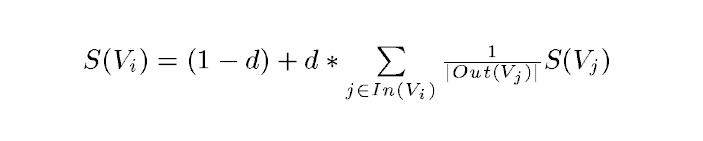

https://blog.csdn.net/zhaozhn5/article/details/79776163

https://blog.csdn.net/leadai/article/details/81230557

Google PageRank算法的思想精华在于：将一个网页级别/重要性的排序问题转化成了一个公共参与、以群体民主投票的方式求解的问题，网页之间的链接即被认为是投票行为。同时，各个站点投票的权重不同，重要的网站投票具有较大的分量，而该网站是否重要的标准还需要依照其PageRank值。这看似是一个矛盾的过程：即我们需要用PageRank值来计算PageRank值~

**pagerank 基本思想**

数量假设：一个页面越被其他页面链接，说明他越重要（ps：难怪好多技术博客的都互相链接）

质量假设：越是被高质量页面链接，说明该页面越重要（ps：最好能被大博主推荐一波，粉丝蹭蹭蹭往上涨）

Pagerank公式

其中 
$S(V_i)​$ 指 页面i的权重

$1-d​$  为随机跳转一个新页面的概率；

d：阻尼因子，通常设为0.85，d即按照超链接进行浏览的概率；
累加表示 指向i的所有页面的权重和($In(V_i)​$),初始时每个页面有指向多少个页面权重就被分为多少($Out(V_j)​$)

所以这里的的 $\frac{S(V_j)}{|Out(V_j)|}$ 指的就是  j页面指向 i的权重 

解法:https://blog.csdn.net/hguisu/article/details/7996185

