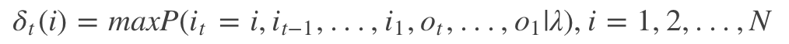
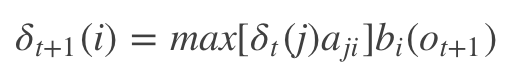
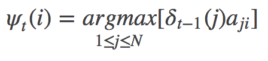
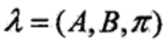
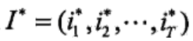
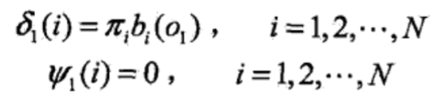
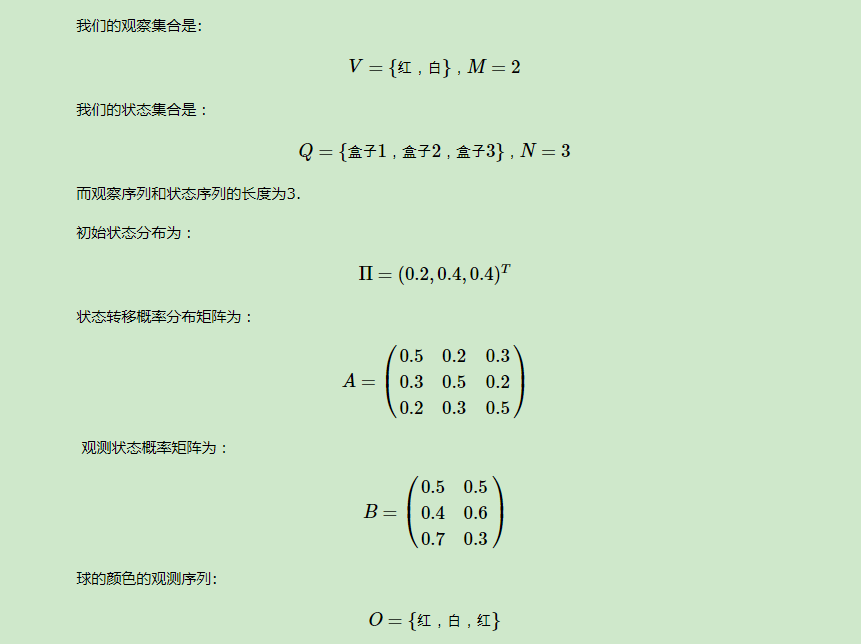
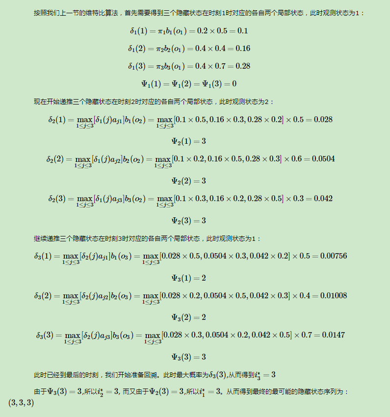

https://blog.csdn.net/athemeroy/article/details/79339546

https://blog.csdn.net/athemeroy/article/details/79342048

https://blog.csdn.net/gzmfxy/article/details/78712878

https://www.cnblogs.com/pinard/p/6991852.html

维特比算法

维特比算法 (Viterbi algorithm) 是机器学习中应用非常广泛的**动态规划算法**，在求解隐马尔科夫、条件随机场的预测以及seq2seq模型概率计算等问题中均用到了该算法。实际上，维特比算法不仅是很多自然语言处理的解码算法，也是现代数字通信中使用最频繁的算法。

viterbi算法简要的概括一下，是一种最优路径的计算方法，它是向前算法的一种变体，比向前算法的复杂度要低很多，并且最终能够得到最优解。

维特比算法的基础可以概括为下面三点（来源于吴军：数学之美）： 

1、如果概率最大的路径经过篱笆网络的某点，则从开始点到该点的子路径也一定是从开始到该点路径中概率最大的。 
2、假定第i时刻有k个状态，从开始到i时刻的k个状态有k条最短路径，而最终的最短路径必然经过其中的一条。 
3、根据上述性质，在计算第i+1状态的最短路径时，只需要考虑从开始到当前的k个状态值的最短路径和当前状态值到第i+1状态值的最短路径即可，如求t=3时的最短路径，等于求t=2时的所有状态结点x2i的最短路径加上t=2到t=3的各节点的最短路径。

为了纪录中间变量，引入两个变量sigma和phi，定义t时刻状态为i的所有单个路径 (i1, i2, ..., it) 中最大概率值（最短路径）为（如果不清楚可以参考一下[隐马尔可夫模型 (HMM) ](https://mp.csdn.net/postedit/87867916)）:

其中it表示最短路径，Ot表示观测符号，lamda表示模型参数，根据上式可以得出变量sigma的递推公式：

其中i = 1, 2, ..., N; t = 1, 2, ... , T-1，定义在时刻t状态为i的所有单个路径 (i1, i2, ..., it, i) 中概率最大的路径的第t－1个结点为：

根据上面的两个定义下面给出维特比算法具体内容：

输入为模型和观测状态分别为：

输出为求出最优路径：

步骤为：(1) 初始化各参数：

#### HMM维特比算法求解实例

　　　　下面我们仍然用[隐马尔科夫模型HMM（一）HMM模型](http://www.cnblogs.com/pinard/p/6945257.html)中盒子与球的例子来看看HMM维特比算法求解。

##### HMM模型维特比算法总结

如果大家看过之前写的[文本挖掘的分词原理](http://www.cnblogs.com/pinard/p/6677078.html)中的维特比算法，就会发现这两篇之中的维特比算法稍有不同。主要原因是在中文分词时，我们没有观察状态和隐藏状态的区别，只有一种状态。但是维特比算法的核心是定义动态规划的局部状态与局部递推公式，这一点在中文分词维特比算法和HMM的维特比算法是相同的，也是维特比算法的精华所在。

　　　　维特比算法也是寻找序列最短路径的一个通用方法，和dijkstra算法有些类似，但是dijkstra算法并没有使用动态规划，而是贪心算法。同时维特比算法仅仅局限于求序列最短路径，而dijkstra算法是通用的求最短路径的方法。

