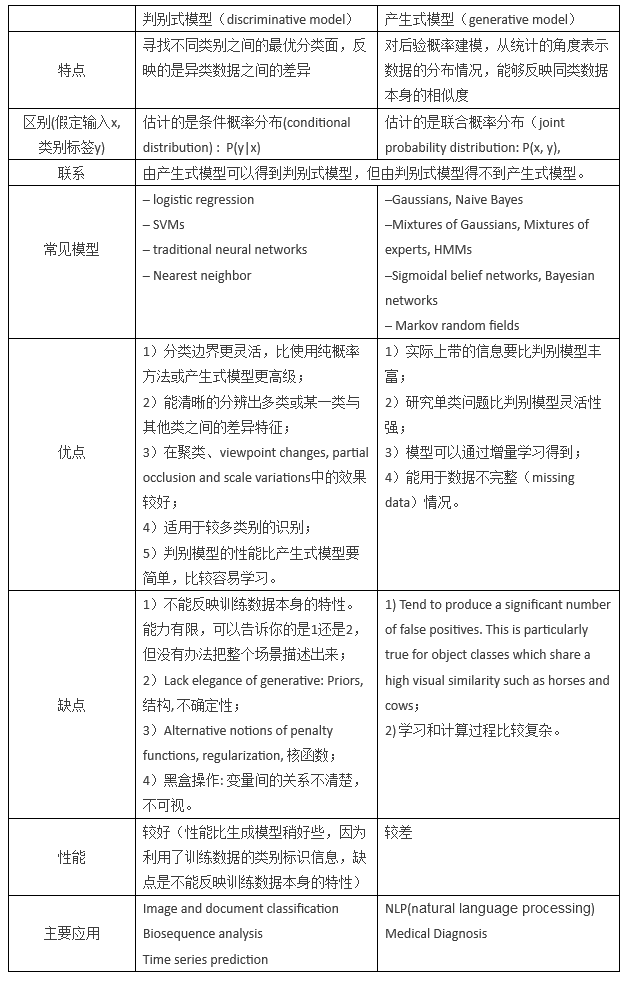

https://blog.csdn.net/weixin_42398658/article/details/84759799

#### **判别式（**discriminative**）模型 vs. 生成式(**generative**)模型**

**1. 判别式模型**

**判别模型是直接对** ![[公式]](https://www.zhihu.com/equation?tex=P%28Y%7CX%29)**建模**，就是说，直接根据X特征来对Y建模训练。针对条件概率建模

具体地，我的训练过程是确定构件 ![[公式]](https://www.zhihu.com/equation?tex=P%28Y%7CX%29) 模型里面“复杂映射关系”中的参数，完了再去inference一批新的sample。

所以判别式模型的特征总结如下：

1. 对 ![[公式]](https://www.zhihu.com/equation?tex=P%28Y%7CX%29) 建模
2. 对所有的样本只构建一个模型，确认总体判别边界
3. 观测到输入什么特征，就预测最可能的label
4. 另外，判别式的优点是：对数据量要求没生成式的严格，速度也会快，小数据量下准确率也会好些。

主要代表模型有:

**Logistic Regression**

**SVM**

**Traditional Neural Networks**

**Nearest Neighbor**

**CRF**

**Linear Discriminant Analysis**

**Boosting**

**Linear Regression**

**2. 生成式模型**

生成式模型学习到的是X与Y的联合模型 ![[公式]](https://www.zhihu.com/equation?tex=P%28X%2CY%29) ，也就是说，**我在训练阶段是只对** ![[公式]](https://www.zhihu.com/equation?tex=P%28X%2CY%29)**建模**，我需要确定维护这个联合概率分布的所有的信息参数。完了之后在inference再对新的sample计算 ![[公式]](https://www.zhihu.com/equation?tex=P%28Y%7CX%29) ，导出 ![[公式]](https://www.zhihu.com/equation?tex=Y) ,但这已经不属于建模阶段了。

结合NB过一遍生成式模型的工作流程。学习阶段，建模： ![[公式]](https://www.zhihu.com/equation?tex=P%28X%2CY%29%3DP%28X%7CY%29P%28Y%29) （当然，NB具体流程去隔壁参考）,然后 ![[公式]](https://www.zhihu.com/equation?tex=P%28Y%7CX%29+%3D+%5Cfrac%7BP%28X%2CY%29%7D%7BP%28X%29%7D) 。
另外，LDA也是这样，只是他更过分，需要确定很多个概率分布，而且建模抽样都蛮复杂的。

所以生成式总结下有如下特点：

1. 对 ![[公式]](https://www.zhihu.com/equation?tex=P%28X%2CY%29) 建模

2. 这里我们主要讲分类问题，所以是要对每个label（ ![[公式]](https://www.zhihu.com/equation?tex=y_%7Bi%7D+) ）都需要建模，最终选择最优概率的label为结果，所以没有什么判别边界。（对于序列标注问题，那只需要构件一个model）

3. 中间生成联合分布，并可生成采样数据。

4. 生成式模型的优点在于，所包含的信息非常齐全，我称之为“上帝信息”，所以不仅可以用来输入label，还可以干其他的事情。生成式模型关注结果是如何产生的。但是生成式模型需要非常充足的数据量以保证采样到了数据本来的面目，所以速度相比之下，慢。

   代表模型:

   **Gaussians**

    **Naive Bayes**

   **Mixtures of Multinomials**

   **Mixtures of Gaussians**

   **Mixtures of Experts**

   **HMMs**

   **Sigmoidal Belief Networks, Bayesian Networks**

   **Markov Random Fields**

   **Latent Dirichlet Allocation**

总结:

