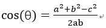
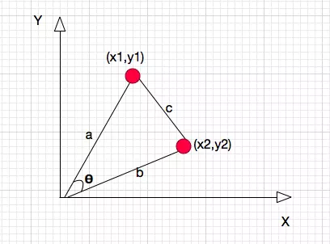
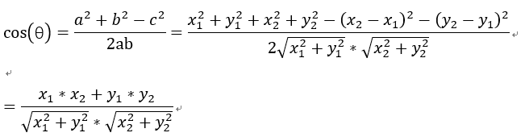
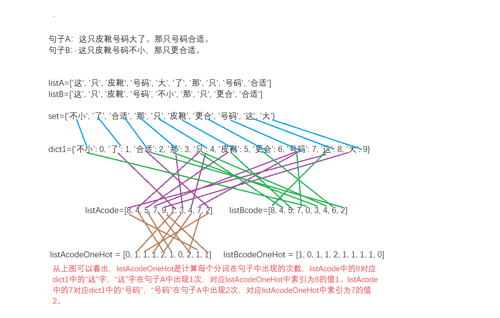
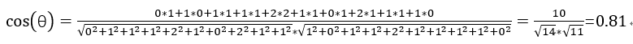

https://blog.csdn.net/qq_15111861/article/details/80138784

https://www.cnblogs.com/airnew/p/9563703.html

余弦相似度用向量空间中两个向量夹角的余弦值作为衡量两个个体间差异的大小。余弦值越接近1，就表明夹角越接近0度，也就是两个向量越相似，这就叫"余弦相似性"。

余弦函数在三角形中的计算公式为：



在直角坐标系中，向量表示的三角形的余弦函数是怎么样的呢？下图中向量a用坐标(x1,y1)表示，向量b用坐标(x2,y2)表示。



向量a和向量b在直角坐标中的长度为向量a和向量b之间的距离我们用向量c表示，那么向量c在直角坐标系中的长度为，将a，b，c带入三角函数的公式中得到如下的公式：




这是2维空间中余弦函数的公式，那么多维空间余弦函数的公式就是：


**余弦相似度**

余弦相似度量：计算个体间的相似度。

相似度越小，距离越大。相似度越大，距离越小。

假设有3个物品，item1，item2和item3，用向量表示分别为：

item1[1,1,0,0,1]，

item2[0,0,1,2,1]，

item3[0,0,1,2,0]，

即五维空间中的3个点。用欧式距离公式计算item1、itme2之间的距离，以及item2和item3之间的距离，分别是：

item1-item2=

item2-item3=

用余弦函数计算item1和item2夹角间的余弦值为：


用余弦函数计算item2和item3夹角间的余弦值为：


由此可得出item1和item2相似度小，两个之间的距离大(距离为7)，item2和itme3相似度大，两者之间的距离小(距离为1)。

 

余弦相似度算法：一个向量空间中两个向量夹角间的余弦值作为衡量两个个体之间差异的大小，余弦值接近1，夹角趋于0，表明两个向量越相似，余弦值接近于0，夹角趋于90度，表明两个向量越不相似。

 

余弦相似度

余弦相似度量：计算个体间的相似度。

相似度越小，距离越大。相似度越大，距离越小。


**余弦相似度算法：**一个向量空间中两个向量夹角间的余弦值作为衡量两个个体之间差异的大小，余弦值接近1，夹角趋于0，表明两个向量越相似，余弦值接近于0，夹角趋于90度，表明两个向量越不相似。

下面我们介绍使用余弦相似度计算两段文本的相似度。思路：1、分词；2、列出所有词；3、分词编码；4、词频向量化；5、套用余弦函数计量两个句子的相似度。

句子A：这只皮靴号码大了。那只号码合适。

句子B：这只皮靴号码不小，那只更合适。

1、分词：

使用结巴分词对上面两个句子分词后，分别得到两个列表：

listA=[‘这‘, ‘只‘, ‘皮靴‘, ‘号码‘, ‘大‘, ‘了‘, ‘那‘, ‘只‘, ‘号码‘, ‘合适‘]

listB=[‘这‘, ‘只‘, ‘皮靴‘, ‘号码‘, ‘不小‘, ‘那‘, ‘只‘, ‘更合‘, ‘合适‘]

 

2、列出所有词，将listA和listB放在一个set中，得到：

set={'不小', '了', '合适', '那', '只', '皮靴', '更合', '号码', '这', '大'}

将上述set转换为dict，key为set中的词，value为set中词出现的位置，即‘这’:1这样的形式。

dict1={'不小': 0, '了': 1, '合适': 2, '那': 3, '只': 4, '皮靴': 5, '更合': 6, '号码': 7, '这': 8, '大': 9}，可以看出“不小”这个词在set中排第1，下标为0。

 

3、将listA和listB进行编码，将每个字转换为出现在set中的位置，转换后为：

listAcode=[8, 4, 5, 7, 9, 1, 3, 4, 7, 2]

listBcode=[8, 4, 5, 7, 0, 3, 4, 6, 2]

我们来分析listAcode，结合dict1，可以看到8对应的字是“这”，4对应的字是“只”，9对应的字是“大”，就是句子A和句子B转换为用数字来表示。

 

4、对listAcode和listBcode进行oneHot编码，就是计算每个分词出现的次数。oneHot编号后得到的结果如下：

listAcodeOneHot = [0, 1, 1, 1, 2, 1, 0, 2, 1, 1]

listBcodeOneHot = [1, 0, 1, 1, 2, 1, 1, 1, 1, 0]

下图总结了句子从分词，列出所有词，对分词进行编码，计算词频的过程




5、得出两个句子的词频向量之后，就变成了计算两个向量之间夹角的余弦值，值越大相似度越高。

listAcodeOneHot = [0, 1, 1, 1, 2, 1, 0, 2, 1, 1]

listBcodeOneHot = [1, 0, 1, 1, 2, 1, 1, 1, 1, 0]



根据余弦相似度，句子A和句子B相似度很高。

代码如下

```python
import jieba
import math
s1 = '这只皮靴号码大了。那只号码合适'
s1_cut = [i for i in jieba.cut(s1, cut_all=True) if i != '']
s2 = '这只皮靴号码不小，那只更合适'
s2_cut = [i for i in jieba.cut(s2, cut_all=True) if i != '']
print(s1_cut)
print(s2_cut)
word_set = set(s1_cut).union(set(s2_cut))
print(word_set)

word_dict = dict()
i = 0
for word in word_set:
    word_dict[word] = i
    i += 1
print(word_dict)

s1_cut_code = [word_dict[word] for word in s1_cut]
print(s1_cut_code)
s1_cut_code = [0]*len(word_dict)

for word in s1_cut:
    s1_cut_code[word_dict[word]]+=1
print(s1_cut_code)

s2_cut_code = [word_dict[word] for word in s2_cut]
print(s2_cut_code)
s2_cut_code = [0]*len(word_dict)
for word in s2_cut:
    s2_cut_code[word_dict[word]]+=1
print(s2_cut_code)

# 计算余弦相似度
sum = 0
sq1 = 0
sq2 = 0
for i in range(len(s1_cut_code)):
    sum += s1_cut_code[i] * s2_cut_code[i]
    sq1 += pow(s1_cut_code[i], 2)
    sq2 += pow(s2_cut_code[i], 2)

try:
    result = round(float(sum) / (math.sqrt(sq1) * math.sqrt(sq2)), 2)
except ZeroDivisionError:
    result = 0.0
print(result)
```


