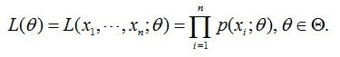
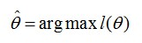
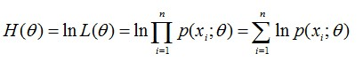

https://www.jianshu.com/p/c57ef1508fa7

https://blog.csdn.net/v_july_v/article/details/81708386

https://www.cnblogs.com/pinard/p/6912636.html

## 最大期望算法

最大期望算法（Expectation-maximization algorithm，又译期望最大化算法）在统计中被用于寻找，依赖于不可观察的隐性变量的概率模型中，参数的最大似然估计。在统计计算中，最大期望（EM）算法是在概率模型中寻找**参数最大似然估计**或者**最大后验估计**的算法，其中概率模型**依赖于**无法观测的**隐性变量**。最大期望算法经常用在机器学习和计算机视觉的数据聚类（Data Clustering）领域。

最大期望算法经过两个步骤交替进行计算，

**第一步是计算期望（E），利用对隐藏变量的现有估计值，计算其最大似然估计值**；

**第二步是最大化（M），最大化在E步上求得的最大似然值来计算参数的值**。***M步上找到的参数估计值被用于下一个E步计算中，这个过程不断交替进行。***


**似然函数**

```
在数理统计学中，似然函数是一种关于统计模型中的参数的函数，表示模型参数中的似然性。“似然性”与“或然性”或“概率”意思相近，都是指某种事件发生的可能性。

而极大似然就相当于最大可能的意思。

比如你一位同学和一位猎人一起外出打猎，一只野兔从前方窜过。只听一声枪响，野兔应声到下，如果要你推测，这一发命中的子弹是谁打的？你就会想，只发一枪便打中，由于猎人命中的概率一般大于你那位同学命中的概率，从而推断出这一枪应该是猎人射中的。

这个例子所作的推断就体现了最大似然法的基本思想。

```

多数情况下我们是根据已知条件来推算结果，而最大似然估计是已经知道了结果，然后寻求使该结果出现的可能性最大的条件，以此作为估计值。

看到没，概率是根据条件推测结果，而似然则是根据结果反推条件。在这种意义上，似然函数可以理解为条件概率的逆反。

假定已知某个参数B时，推测事件A会发生的概率写作：


  通过贝叶斯公式，可以得出


现在我们反过来：事件**A**发生已经了，请通过似然函数，估计参数**B**的可能性。

​    一上公式，你可能就懵圈了。然后回想起我前沿开头所说的话：难道就没有一篇通俗易懂的么？

​    答案，当然是有的。我们从一个具体的例子人手。

 **似然函数举例：已知样本X，求参数**θ

假定我们需要统计10万学生中男生女生的身高分布，怎么统计呢？考虑到10万的数量巨大，所以不可能一个一个的去统计。对的，随机抽样，从10万学员中随机抽取100个男生，100个女生，然后依次统计他们各自的身高。

对于这个问题，我们通过数学建模抽象整理下

1,首先我们从10万学员中抽取到100个男生/女生的身高，组成样本集X，X={x1,x2,…,xN}，其中xi表示抽到的第i个人的身高，N等于100，表示抽到的样本个数。
2,假定男生的身高服从正态分布 ，女生的身高则服从另一个正态分布：  。
3,但是这两个分布的均值u和方差∂2都不知道（别问我，均值是啥，方差又是啥，请查Google或Wikipedia），设为未知参数θ=[u, ∂]T
4,现在需要用极大似然法（MLE），通过这100个男生或100个女生的身高结果，即样本集X来估计两个正态分布的未知参数θ，问题定义相当于已知X，求θ，换言之就是求p(θ|x)
  因为这些男生（的身高）是服从同一个高斯分布p(x|θ)的。那么抽到男生A（的身高）的概率是p(xA|θ)，抽到男生B的概率是p(xB|θ)，考虑到他们是独立的，所以同时抽到男生A和男生B的概率是p(xA|θ)* p(xB|θ)。

  同理，我从分布是p(x|θ)的总体样本中同时抽到这100个男生样本的概率，也就是样本集X中100个样本的联合概率（即它们各自概率的乘积），用下式表示：



 插一句，有个文章中会用这个表示p(x|θ)，有的文章会用p(x;θ)，不过，不管用哪种表示方法，本质都是一样的。当然，如果涉及到Bayes公式的话，用前者表示p(x|θ)更好。

   在那么多男学员中，我一抽就抽到这100个男生，而不是其他人，那说明在整个学校中，这100个人（的身高）出现的概率最大啊，这个概率就是上面这个似然函数L(θ)，怎么做到的呢？换言之，怎样的θ能让L(θ)最大？

**极大似然即最大可能**

假定我们找到一个参数，能使似然函数L(θ)最大（也就是说抽到这100个男生的身高概率最大），则应该是“最可能”的参数值，相当于θ的极大似然估计量。记为：



这里的L(θ)是连乘的，为了便于分析，我们可以定义对数似然函数，将其变成连加的：




 现在需要使θ的似然函数L(θ)极大化，然后极大值对应的θ就是我们的估计。

  对于求一个函数的极值，通过我们在本科所学的微积分知识，最直接的设想是求导，然后让导数为0，那么解这个方程得到的θ就是了（当然，前提是函数L(θ)连续可微）。但，如果θ是包含多个参数的向量那怎么处理呢？当然是求L(θ)对所有参数的偏导数，也就是梯度了，从而n个未知的参数，就有n个方程，方程组的解就是似然函数的极值点了，最终得到这n个参数的值。

求极大似然函数估计值的一般步骤：

1,写出似然函数；
2,对似然函数取对数，并整理；
3,求导数，令导数为0，得到似然方程；
4,解似然方程，得到的参数即为所求；

#### EM算法的第三个例子：抛硬币

Nature Biotech在他的一篇EM tutorial文章《Do, C. B., & Batzoglou, S. (2008). What is the expectation maximization algorithm?. Nature biotechnology, 26(8), 897.》中，用了一个投硬币的例子来讲EM算法的思想。

a情况相信大家都很熟悉，既然能观测到试验数据是哪枚硬币产生的，就可以统计正反面的出现次数，直接利用最大似然估计即可。

b如果不知道抛的是A还是B（这时就刺激了吧，对的，这就是咱们不知情的隐变量），只观测到5轮循环每轮循环10次，共计50次投币的结果，这时就没法直接估计A和B的正面概率。这时，就轮到EM算法出场了（见下图b）。


理解:

E步:

1,先随机初始化参数值   

2,根据初始化的参数值计算硬币属于A还是B的概率 

M步 

1,根据计算的概率重新修正 参数

2,重新进行E步  直到收敛

文中的公式为:

$P_A=C_{10}^5(θ_A)5∗(1−θ_A)^{10−5}$, 

然后同理可以求出此时$P_B$, 

两者归一化后就可以得到这次用硬币A的概率为0.45了,此时实际发生正面向上的次数是5,所以这次硬币A正面向上的期望为5∗0.45=2.2, 
同理这样算完一轮,累加就可以得到$θ^(1)​$,这就是M-step, 
迭代多次后正面向上概率收敛,就可以当做预测结果了.


