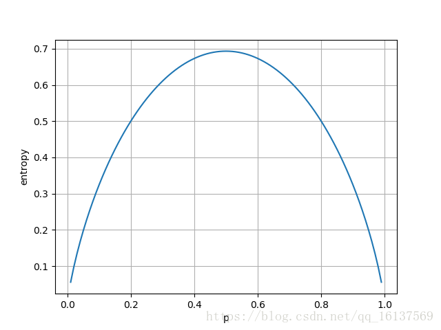

https://www.jianshu.com/p/e7c13002440d

https://blog.csdn.net/ccblogger/article/details/81843304

https://blog.csdn.net/golden1314521/article/details/45576089

最大熵模型（Maximum Entropy Model，MaxEnt）是一种很经典的分类算法，理解它有助于加深我们对逻辑回归、支持向量机、决策树等算法的理解。**最大熵模型是将最大熵原理应用到分类任务得到的模型**。在解释最大熵原理和最大熵模型之前，先简单对熵的概念进行一下回顾。

#### 信息熵，联合熵，条件熵

信息论的基本想法是发生一个不太可能发生的事件比发生一个非常可能发生的事件能提供更多的信息。比如说，“今天早上太阳升起”几乎一定会发生的，这句话包含的信息量很少；如果说“今天早上有日食”，日食是非常罕见的，那么这句话包含的信息量就很多了。一个事件x=x包含的信息量称为**自信息**（Self-information），自信息也可以理解为事件发生之前的不确定性：

I(x)=−logP(x)

其中log以2为底时，I(x)的单位是比特或香农；log以e为底时，I(x)单位是奈特，为了计算方便，本文都是自然对数。 
　　自信息只能处理单个的输出。我们可以用香农熵（也叫**信息熵**）来对整个概率分布中的不确定性总量进行量化：


对于离散变量


换而言之，一个分布的信息熵是遵循这个分布的事件所产生信息总量的期望，即所有自信息的加权平均。信息熵满足下列不等式：


其中|X|是X取值的个数。那些接近确定的分布（输出几乎可以确定）具有较低的熵；那些接近均匀分布的概率具有较高的熵。当且仅当X的分布是均匀分布事上式右边的等号成立，所以X服从均匀分布时熵最大。 
　　以二值随机变量为例，说明更接近确定性的分布是如何具有较低的信息熵。下图中x轴是p，表示二值随机变量等于1的概率，其信息熵由−(plogp+(1−p)log(1−p))给出。当p接近0或者1时，分布几乎是确定的，当p=0.5时，是一个均匀分布，熵达到最大值1。这正好符合ln2=0.693ln⁡2=0.693（二值变量只有2个取值）。 




该部分测试代码如下：

```python
import matplotlib.pyplot as plt
import numpy as np

x = np.arange(0, 1, 0.01)   # 这里就没额外考虑log的值域了，会有个warning
entropy = -1 * (x * np.log(x) + (1 - x) * np.log(1 - x))  # ∑ p(x)logp(x)

plt.plot(x, entropy)
plt.xlabel('p'), plt.ylabel('entropy')
plt.grid(), plt.show()
```

推广到多个变量的**联合熵**：


联合熵是是在联合自信息I(X,Y)的期望。 
　　**条件熵**是已知随机变量X的条件下随机变量Y的不确定性：


#### 最大熵思想

我们知道，分类模型有判别模型和生成模型两种，判别模型是要学习一个条件概率分布 P(y|x)。
 举例说明，x是病人身体指标，体温、血压、血糖，y是各种可能的疾病，可简化为小病、中病、大病三种。

现在，我们有一个样本x1={体温：30，血压：160，血糖：60}，那么P(y|x1)就是一个概率分布，该分布的值就是上面简化的三种，小病、中病、大病。可能的概率分布如下所示：


当然，这样的分布有无数种，上面只是举例说明而已。那么，问题来了，在这无数种概率分布中，哪一个才是好的呢？

为了选出一个好的分布，可以做如下两步：

- 1、看看以往的病例中，指标x1={体温：30，血压：160，血糖：60}和三种病之间的关系，如果没有这样的病例，也就是说我们没有过往的经验可以参考，那么，就直接选一个熵最大的分布就是，也就是上面表格中的第三个分布，因为均匀分布总是同类分布中熵最大的分布。
- 2、如果查看以往病例后，我们得到一个经验，指标x1={体温：30，血压：160，血糖：60}有1/2的概率是小病，于是我们有了一定的经验知识，此时，最好的分布就是**符合这个经验知识的前提下，熵最大**的分布，显然，第一个分布就是最好的分布。

以上，我们就是运用了最大熵的思想。总结来说，最大熵的思想是，当你要猜一个概率分布时，如果你对这个分布一无所知，那就猜熵最大的均匀分布，如果你对这个分布知道一些情况，那么，就猜满足这些情况的熵最大的分布。

**运用最大熵思想来做多分类问题**

现在，我们来看最大熵模型是如何运用最大熵思想的。
还是上面的例子，假设我们不只有一个x1样本，而是有x1、x2、...、xN个样本。并且知道每一个样本所得的病y1、y2、...、yN，yi是小病、中病、大病三者之一。这个时候，我们要怎么运用最大熵思想呢？

首先，我们要认真考虑一下这个例子和第2部分中的例子的不同之处，在第2部分的例子中，我们只有一个样本x1，并且假设我们有关于x1的先验知识，那就是1/2的概率是小病，要求的概率分布只有一个，那就是P(y|x1)。

现在，我们有N个样本和它们的标签。这些**标签就是我们现在的先验知识**，即，对于xi，我们知道它的标签是yi，这个先验知识与第2部分例子中的已知的1/2概率不再是同一种形式了。

其次，此时我们要求的模型P(y|x)已经不是一个概率分布，而是**无数个概率分布**，因为，每一个x都会对应一个P(y|x)。但是，这无数个分布可以用一个关于x的函数来表示，即 P(y|x) ~x。这样，我们只要求出这个函数的形式和它的参数值，就算求出了模型P(y|x)。
 在后面的叙述中，P(y|x)有时代表某个x下y的条件概率分布，有时也指无数个分布的集合，即关于x的函数。请注意辨别。

请思考一下，在这种情况下，如何贯彻最大熵思想来求解条件概率 P(y|x)?

首先，我们回顾一下最大熵思想：

当你要猜一个概率分布时，如果你对这个分布一无所知，那就猜熵最大的均匀分布，如果你对这个分布知道一些情况，那么，就猜满足这些情况的熵最大的分布。

其实，我们只要两步就可以贯彻最大熵思想：

**1、找出满足现有情况的分布P(y|x)。**

虽然我们现在对P(y|x)的形式和参数还是一无所知，但这并不妨碍我们从概率分布的层面上去考察它的一些特点。也就是P(y|x)要满足的一些约束，这些约束，就是对我们已知的先验知识的拟合。我们的先验知识就是N个训练样本（xi，yi）。假设我们通过观察这N个样本，发现了一个事实：

当体温小于38，血压小于100，血糖小于30时，总是得小病。这就是一个综合后的先验知识。我们可以据此定义一个特征函数：

f(x,y) = 1   当且仅当   x ={体温小于38，血压小于100，血糖小于30}，y=小病

将f(x,y)运用到任一个样本（xi，yi）上，我们就可以知道该样本是不是满足上述事实。你可以认为，f(x,y)是对样本是否符合某个事实的判定函数。

也许你还是会对这个特征函数感到迷惑，请暂时放下迷惑，只要相信，这一切都是为了让我们能更加形式化地定义：什么样的P(y|x)是满足现有情况的。

根据已有的N个样本，我们可以算出P(x,y)的经验分布P~(x,y)和P(x)的经验分布P~(x)。
 然后，我们就可以统计下，在这个经验分布中，f(x,y)的期望是多少，如下所示


这个期望表示什么意思呢？它表示的是，就我们的经验分布来看，满足 x ={体温小于38，血压小于100，血糖小于30}，y=小病这一事实的样本占总体样本的比率。比如说是1/3，表示从我们的经验分布看，一个样本有1/3的概率是符合这个事实的。

那么，我们求出的P(y|x)也要符合这个期望值才能算是满足现有情况。至此，我们终于找到一个衡量P(y|x)是否满足现有情况的指标。但是，还有最后一个问题，我们的P(y|x)是条件分布，衡量分布是否满足现有情况时，需要联合分布。

这个问题，很好解决，我们有了x的经验分布P~(x)，将这个经验分布乘以P(y|x)就可以近似表示我们的P(y|x)背后的联合分布，据此，我们可以写出P(y|x)要满足的一个约束：


我们求出的P(y|x)满足这个约束条件，就相当于满足了现有的 x ={体温小于38，血压小于100，血糖小于30}，y=小病这一事实。这个事实来自于我们对N个样本的观察总结。

当然，观察N个样本，我们还可以得出其他事实，每一个事实都可以按照上述步骤，为P(y|x)施加一个“紧箍咒”。这个事实总结的越准确，我们就越能窥见要求的P(y|x)的模样。

**2、使得P(y|x)的熵最大化**

假设我们现在已经找出了所有满足上面约束条件的P(y|x)，现在，我们要运用最大熵思想来从中找出熵最大的P(y|x)。

这里运用最大熵思想时，我们要将P(y|x)看做是无数个概率分布的集合，即**每一个x，都对应一个特定的概率分布P(y|x)，每一个概率分布都会有一个熵，此时，所谓的最大熵，就是最大化这些所有的概率分布的熵的和，由于每个x都有一个经验概率P~(x)，我们还需要对所有这些熵进行加权求和，以此表示哪一个概率分布的熵的最大化更加重要**。如下所示：


**3、求解最大熵模型**

对前面的内容进行整理，我们得出如下的优化数学问题：


注意：这里的 i=1,...,n表示我们对样本观察得出的n个事实，可不是N个样本哦。同时，这里通过加负号的办法，将最大化问题转化成了最小化问题。

为啥我们喜欢最小化而不喜欢最大化呢，因为最小化相当于就坡往下滚，省劲，爽，最大化相当于上坡，费劲，累。哈哈，如果你当真我就服了你！

到这一步，我们稍微回顾一下。

- 我们到现在都不知道P(y|x)的函数形式是什么，参数有多少，我们仅仅是从概率分布的抽象层面上进行讨论，确定它要满足的一些约束
- 每一个约束都来自于我们凭借已有知识，对N个样本进行观察总结得出的一个事实。
- 按照最大熵思想求P(y|x)时，我们是对所有可能的概率分布的熵进行了加权求和。然后最大化这个和，而不是某个单一的概率分布的最大熵。

那么，剩下的工作就应该由数学家帮我们搞定了，因为我们已经将问题完全形式化为一个约束最优化问题了！

由于下面涉及很多具体的数学，在叙述时，我尽可能不涉及具体的数学，而只从整体的思路上说，以防止具体的数学干扰我们对模型的理解。
 具体的求解方法和svm的求解是一致的，利用拉格朗日函数转为求解对偶问题。对偶问题如下所示：


求解分为两步：
第一步是求对偶问题里面的最小化问题，该问题求解完成后，我们可以看到P(y|x)的形式，如下所示：


形式虽然有了，但是里面的参数w还没有具体确定，第二步的最大化就是来确定参数w的。

第二步，最大化。将P_w(y|x)带入L(P,w)，最大化该函数的值，也就是求对偶问题外层的最大化问题，从而求出具体的w。


#### 详细最大熵原理推理


#### 总结

最大熵模型在分类方法中算是比较优的模型，但是由于它的约束函数数目一般来说会随着样本量的增大而增大，导致样本量很大的时候，对偶函数的优化求解过程非常慢。 
　　MaxEnt优点是可以灵活设置约束条件，通过约束条件的多少可以调节模型对未知数据的适应度和对已知数据的拟合度。缺点是约束函数数量和样本数目有关，导致迭代过程计算量巨大，实际应用比较难。


